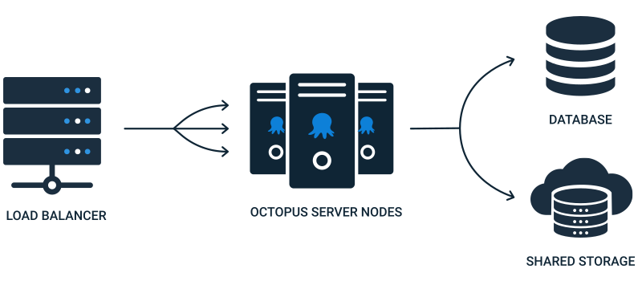

Octopus: High Availability (HA) enables you to run multiple Octopus Server nodes, distributing load and tasks between them. We designed it for enterprises that need to deploy around the clock and rely on the Octopus Server being available.



An Octopus High Availability configuration requires four main components:

- **A load balancer**
  This will direct user traffic bound for the Octopus web interface between the different Octopus Server nodes.
- **Octopus Server nodes**
  These run the Octopus Server service. They serve user traffic and orchestrate deployments.
- **A database**
  Most data used by the Octopus Server nodes is stored in this database.
- **Shared storage**
  Some larger files - like [packages](/docs/packaging-applications/package-repositories/), artifacts, and deployment task logs - aren't suitable to be stored in the database, and so must be stored in a shared folder available to all nodes.

## Licensing

Each Octopus Deploy SQL Server database is a unique **Instance**.  Nodes are the Octopus Server service that connects to the database.  High Availability occurs when two or more nodes connect to the same Octopus Deploy database.  An HA Cluster refers to all components, the load balancer, nodes, database, and shared storage.

For self-hosted customers, High Availability is available to the following licenses type:

- High Avalability (discontinued license type): limited to 2, 3, or 4 nodes.
- Data Center (discontinued license type): unlimited nodes
- Server: unlimited nodes

All other license types, such as Standard, Enterprise, Team, and Professional, are limited to a single node and cannot be used for High Availablity.

The node limit is included in the license key in the NodeLimit node.

```xml
<NodeLimit>Unlimited</NodeLimit>
```

If you do not have that node in your license key then you are limited to a single node.  If you recently purchased a license key and it is missing that node then reach out to [sales@octopus.com](mailto:sales@octopus.com).

## How High Availablity Works

In broad terms, HA allows for load to be distributed between multiple Octopus Server nodes.  How that load is distributed, specifically tasks, is more complex than "it's load balanced."

Learn more in our [How High Availability Works](/docs/administration/high-availability/how-high-availability-works/) section.

## Designing Octopus High Availability

There are several ways to configure High Availability for Octopus and this differs based on both how and where you host Octopus. We have created guides that will help you design the best solution for your installation. 

This section walks through the different options and considerations for setting up Octopus and how you can incorporate each of the components, making them highly-available, whether you're using Windows Servers or running the [Octopus Server Linux Container](/docs/installation/octopus-server-linux-container/) in Kubernetes, hosted on-premises or in the Cloud.

- [Designing Octopus for High Availability On-Premises](/docs/administration/high-availability/design/octopus-for-high-availability-on-premises/)
- [Designing Octopus for High Availability in Azure](/docs/administration/high-availability/design/octopus-for-high-availability-on-azure/)
- [Designing Octopus for High Availability in AWS](/docs/administration/high-availability/design/octopus-for-high-availability-on-aws/)
- [Designing Octopus for High Availability in GCP](/docs/administration/high-availability/design/octopus-for-high-availability-on-gcp/)
- [Designing Octopus for High Availability in Kubernetes](/docs/installation/octopus-server-linux-container/octopus-in-kubernetes/)

## Configuring Octopus High Availability

When you have selected the approach you will use for Octopus High Availability and provisioned your infrastructure, the next step is to configure it. This section includes guides on configuring Octopus for High Availability with and without Active Directory:

- [Configuring High Availability: with Active Directory](/docs/administration/high-availability/configure/octopus-with-active-directory/)
- [Configuring High Availability: without Active Directory](/docs/administration/high-availability/configure/octopus-without-active-directory/)

## Migrating to High Availability

Most organizations start with a stand-alone Octopus installation as part of a Proof of Concept. We make it straight-forward to take your existing Octopus installation and migrate it to a highly-available configuration.

Learn more in our [Migrating to High Availability](/docs/administration/high-availability/migrate/) section.

## Maintaining High Availability nodes

One great benefit of Octopus High Availability is the ability to update and restart one or more nodes, while still allowing the rest of the Octopus Deploy cluster to keep serving requests and performing deployments. 

This section contains useful information on how to maintain the nodes in your Octopus High Availability cluster, along with specific things to know when running an Octopus High Availability instance:

- [Maintaining High Availability nodes](/docs/administration/high-availability/maintain/maintain-high-availability-nodes/)
- [Polling Tentacles with Octopus High Availability](/docs/administration/high-availability/maintain/polling-tentacles-with-ha/)

## Load balancing

There are plenty of options when it comes to choosing a load balancer to direct user traffic between each of the Octopus Server nodes. You can also use Apache or NGINX as a reverse load-balancing proxy. For more information on setting up a load balancer with Octopus High Availability we have the following guides:

- [Configure Netscaler](/docs/administration/high-availability/load-balancing/configuring-netscaler/)
- [Using NGINX as a reverse proxy with Octopus](/docs/security/exposing-octopus/use-nginx-as-reverse-proxy/)
- [Using IIS as a reverse proxy with Octopus](/docs/security/exposing-octopus/use-iis-as-reverse-proxy/)

## Auditing

From **Octopus 2023.1**, audit events include the IP address of the client that initiated the request. As High Availability redirects user traffic through a load balancer, the default value of the IP address in audit events will be the IP address of the load balancer rather than the client's IP address. See [IP address forwarding](/docs/security/users-and-teams/auditing/index.md#ip-address-forwarding) for configuring trusted proxies in Octopus.

## Troubleshooting

If you're running into issues with your Octopus High Availability then please use our [Troubleshooting High Availability](/docs/administration/high-availability/troubleshooting/) guide.
