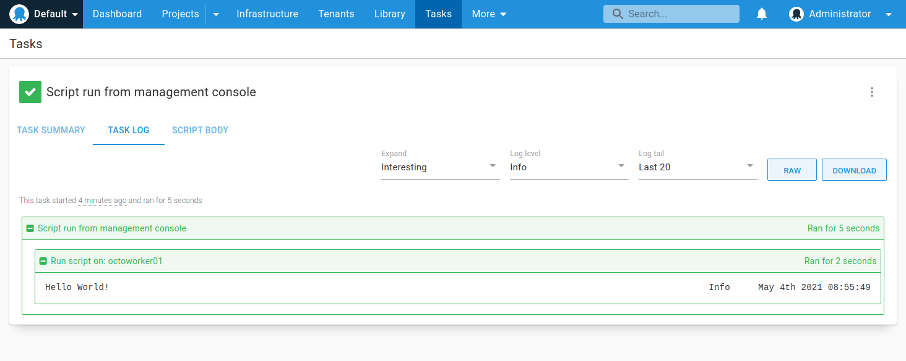
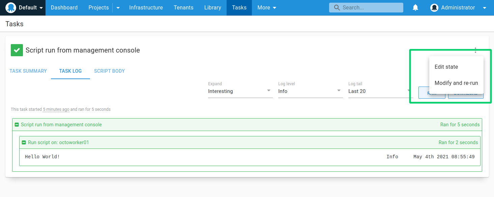

Octopus is designed to make deployment a repeatable process, avoiding the human error that is introduced when software is configured by hand, or in an ad-hoc fashion. Projects, deployment processes, releases, and deployments are all important concepts for realizing this aim.

When managing a large fleet of machines, however, it is occasionally necessary to perform one-off management tasks.

- Run-away processes need to be terminated.
- Machines need to be rebooted.
- Information needs to be collected.

For these situations, the Octopus **Script Console** can be used.

Any machines registered with Octopus as [workers](/docs/infrastructure/workers/index/) or [deployment targets](/docs/infrastructure/deployment-targets/) can be targeted by the Script Console. You can target an individual machine, or perform a task across an entire group of machines.

## Use the Script Console

The Script Console can be found under the Tasks area:

Inside the Script Console, you can choose whether to run your script on:
- One or more individual [deployment targets](/docs/infrastructure/deployment-targets/).
- One or more individual [workers](/docs/infrastructure/workers/).
- All workers in a set of [worker pools](/docs/infrastructure/workers/worker-pools/).
- All deployment targets in a set of environments, roles and tenants or an entire group of machines.
- The Octopus Server. **Note:** This option is only available for Octopus Server, and not for [Octopus Cloud](/docs/octopus-cloud/).

:::hint
The options shown inside the Script Console may differ from the ones described here depending on the permissions assigned to your user account, or if you are using [Octopus Cloud](/docs/octopus-cloud/).
:::

When you run the script, you'll be taken to the task output page which shows the progress and any output from the script:

The **Script Body** tab can be used to see the contents of the script, and you can use the **Modify and re-run** button in the ... overflow menu to change or run the script again.

## Targeting the Octopus Server

You can target the Octopus Server using the Script Console providing you are on a self-hosted instance (and not [Octopus Cloud](/docs/octopus-cloud/)) and the [built-in worker](/docs/infrastructure/workers/built-in-worker/) is enabled.

However, please consider the security implications of allowing ad-hoc scripts to be executed on your Octopus Server.

Learn more about [hardening Octopus](/docs/security/hardening-octopus/).

If you want to run ad-hoc tasks on [Octopus Cloud](/docs/octopus-cloud/), you should make use of [dynamic workers](/docs/infrastructure/workers/dynamic-worker-pools/) or install a Tentacle agent on your own Virtual Machines and register that Tentacle as a worker or deployment target.

## Script Console permissions

To access the Script Console, you'll need to have either:
- The `AdministerSystem` permission or 
- The `TaskCreate` permission assigned to the [Space](/docs/administration/spaces/) you're working in.

The permissions needed to execute a task will depend on the options chosen inside the Script Console.

For example, to execute a script from the Script Console against one or more deployment targets in an environment, you'd need the following permissions:

- `MachineEdit` for the deployment target(s) in that environment.
- `TaskCreate` to create a task in that environment.

Similar permissions would also need to be granted if you were selecting specific Tenants.

To learn how to configure access to the Script Console for a subset of users, take a look at this [knowledge base article](https://help.octopus.com/t/permissions-required-for-script-console-access-only/24790/).

## Collect artifacts {#ScriptConsole-Collectingartifacts}

Sometimes you might like to collect files from each of the machines as part of your script. To do this, see the section on [artifacts](docs/projects/deployment-process/artifacts/).

## Audit records {#ScriptConsole-Auditrecords}

Besides making it easy to run a script on many servers, the other advantage of using the Script Console is auditing. Ad-hoc scripts run via the Script Console will appear in the [Audit](/docs/security/users-and-teams/auditing/) tab in the Configuration area.

