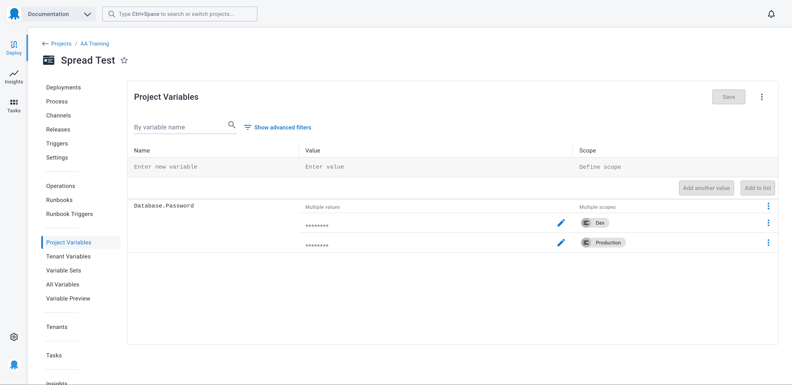
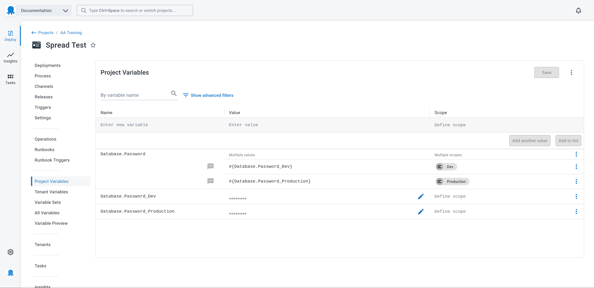

---
layout: src/layouts/Default.astro
pubDate: 2099-01-01
modDate: 2099-01-01
title: Migrating spaces with octoterra
description: How to migrate spaces using the octoterra tool
navOrder: 100
hideInThisSection: true
navSearch: false
navSitemap: false
navMenu: false
robots: noindex, follow
---

[Octoterra](github.com/OctopusSolutionsEngineering/OctopusTerraformExport/actions) exports Octopus projects, runbooks, and spaces to a Terraform module. Octoterra can be used to migrate resources between spaces and instances.

Octoterra Wizard prepares a source space to allow the space and projects to be migrated to a new space or instance. It configures runbooks on the source space to run Octoterra and to apply the Terraform modules created by Octoterra.\

This documentation provides details on how to use the Octoterra Wizard to migrate a space from one instance to another, as well as noting the limitations and any special requirements of the process.

## Limitations of Octoterra and migrating projects between instances

There are limitations that must be accounted for as part of a migration.

### Sensitive values

Sensitive values are not exposed by the Octopus API and therefore are not captured in the Terraform configuration created by Octoterra.

Sensitive variables can be passed to the Terraform module if the source Octopus instance deploys the Terraform configuration itself, as Octopus exposes sensitive values to a deployment process or runbook. In order to ensure sensitive variables can be passed to the Terraform configuration, all sensitive variables must be unscoped and have a unique name. Existing sensitive variables can be modified to fulfil these requirements by spreading them. See the section on variable spreading for more information.

The sensitive values associated with feed, account, and Git credentials, the contents of certificate, sensitive values embedded in steps (such as the `Deploy to IIS` step), and sensitive values defined as parameters on step templates can not be captured by Octoterra. These values are replaced with placeholder values and must be manually reentered on the destination instance once the space has been migrated.

### New step framework

Some steps rely on a new framework. Steps that use the new framework are not currently supported by the Terraform provider. These steps can not be exported by Octoterra.

Octoterra will display an error like this when an unsupported step is encountered:

```bash
Action <step name> has the "Items" property, which indicates that it is from the new step framework. These steps are not supported and are not exported.
```

### Config-as-Code (CaC) repositories

Octoterra converts CaC projects back to regular projects as part of the migration. The project can be converted back to CaC on the destination space. 

However, be aware that Octopus does not support sharing project CaC configuration between two projects. You are prevented from doing so with multiple projects on a single Octopus instance. While you are not prevented from configuring two projects against a shared CaC project configuration from multiple Octopus instance, there are cases where the CaC configuration references space specific resource IDs, such as step templates, which have unique (and incompatible) IDs across spaces and instances. This means you can not assume you can configure a new project in a new space or on a new instance against an existing project CaC configuration hosted in Git.

The recommended solution is to convert the projects in the destination space to a new directory or Git repository. This ensures that the new projects have valid CaC configuration.

### Other settings

The following is a non-exhaustive list of settings that are not exported by Octoterra:

* Users, teams, and roles
* Authentication settings
* Packages in the built-in feed
* Audit logs
* Releases and deployments
* Runbook runs
* Subscriptions
* API Keys
* SIEM settings
* GitHub app connections
* License details
* Node configuration
* SMTP settings
* Insights dashboards

## Spreading sensitive variables

In order for Octopus to expose sensitive variables defined in the project and in library variable sets to the Terraform module created by Octoterra, each sensitive variable must have a unique name and no scopes.

However, it is common for sensitive variables to share a name use scopes to define unique values for different contexts. For example, you may have two sensitive variables called `Database.Password`, with the first variable scoped to the `Dev` environment, and the second scoped to the `Production` environment. This is demonstrated in the screenshot below:



The process of renaming the sensitive variables, removing their scopes, and recursively referencing them via regular variables that have the names and scopes of the original sensitive variables is called "spreading" the variables.

Here is a screenshot that shows the spread variables:



Existing steps that referenced the variable `Database.Password` will continue to function, as the value of that variable is recursively resolved from the Octostache template syntax in the regular variable to return the value held by the referenced sensitive variable.

Because each sensitive variable now has a unique name and no scope, the value of sensitive variables can be reliably passed to a Terraform module applied by Octopus, effectively allowing sensitive variables to be migrated.

Note there are security considerations to take into account with variable spreading. Notably, every sensitive variable is exposed to every deployment or runbook run.

:::div{.warning}
It is important to understand the implications of variable spreading before migrating projects with the Octoterra Wizard.
:::

## Prerequisites

These are the prerequisites for migrating projects with octoterra:

* Download octoterra from [GitHub](https://github.com/OctopusSolutionsEngineering/OctopusTerraformExport)
* Install [Terraform](https://developer.hashicorp.com/terraform/install)
* An API key for the source Octopus instance
* An API key for the destination Octopus instance
* A remote [Terraform backend](https://developer.hashicorp.com/terraform/language/settings/backends/configuration) is to maintain the state of the Terraform resources. AWS S3 and Azure Storage Accounts are supported.
