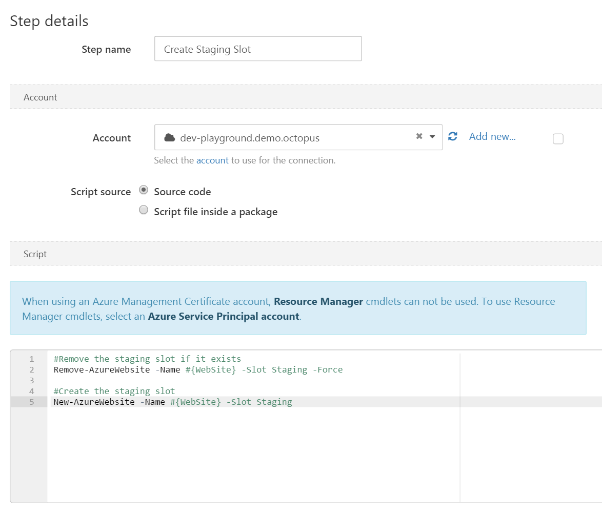

Octopus can help you to run scripts on targets within Microsoft Azure.

Within your Azure scripts, you can use all of the features we provide for [custom scripts](/docs/deployments/custom-scripts/index.md), like [using variables](/docs/deployments/custom-scripts/using-variables-in-scripts.md), [passing parameters](/docs/deployments/custom-scripts/passing-parameters-to-scripts.md), publishing [output variables](/docs/deployments/custom-scripts/output-variables.md) and [collecting artifacts](/docs/deployments/custom-scripts/index.md#Customscripts-Collectingartifacts).

These scripts typically rely on tools being available when they execute.

It is best that you control the version of these tools - your scripts will rely on a specific version that they are compatible with to function correctly.

The easiest way to achieve this is to use an [execution container](/docs/projects/steps/execution-containers-for-workers/index.md) for your script step.

If this is not an option in your scenario, we recommend that you provision your own tools on your worker.

:::warning
Using the Azure tools bundled with Octopus Deploy is not recommended. Octopus bundles versions of the Azure Resource Manager Powershell modules (AzureRM) and Azure CLI. These were originally provided as convenience mechanisms for users wanting to run scripts against Azure targets. The versions bundled are now out of date, and we will not be updating them further.

From **Octopus 2021.2**, a warning will also appear in the deployment logs if the Azure tools bundled with Octopus Deploy are used in a step.

We recommend you configure Octopus Deploy to use your own [version of the Azure PowerShell cmdlets](/docs/deployments/azure/running-azure-powershell/configuring-the-version-of-the-azure-powershell-modules.md) and [version of the Azure CLI](/docs/deployments/azure/running-azure-powershell/configuring-the-version-of-the-azure-cli.md).
:::

When executing PowerShell against Azure, Octopus Deploy will automatically use your configured Azure account details to authenticate you into the [AzureRM PowerShell modules](https://docs.microsoft.com/powershell/azure/azurerm/overview), the [Azure PowerShell modules](https://docs.microsoft.com/powershell/azure/overview), and [Azure CLI tools](https://docs.microsoft.com/cli/azure/), if they exist on the worker executing the script.

This functionality requires the Azure CLI version 2.0 or above to be installed on the worker.

**Choosing the right Azure account type**

Azure supports two authentication methods, each of which provides access to a different set of Azure APIs:

- To use the Azure Service Management (ASM) API, use an [Azure Management Certificate Account](/docs/infrastructure/accounts/azure/index.md#azure-management-certificate).
- To use the Azure Resource Management (ARM) API, use an [Azure Service Principal Account](/docs/infrastructure/accounts/azure/index.md#azure-service-principal).
  - The ARM PowerShell cmdlets are prefixed with `AzureRM`, like `Get-AzureRMWebApp`.
  - The Az PowerShell cmdlets are prefixed with `Az`, like `Get-AzWebApp`.

Learn more about [configuring the right Azure Account](/docs/infrastructure/accounts/azure/index.md).

## Running Scripts in Octopus Cloud

Octopus Cloud uses a special type of worker pool called a [Dynamic Worker Pool](/docs/infrastructure/workers/dynamic-worker-pools.md). Octopus provides these, and you cannot easily install custom versions of the Azure tools on them.

To use your own version of the Azure CLI or Azure Powershell cmdlets when using Dynamic Worker Pools, please do the following:

- Configure your step to use a Dynamic Worker pool that supports [execution containers](/docs/projects/steps/execution-containers-for-workers/index.md).
- Configure your step to run in an execution container with a [compatible docker image](/docs/projects/steps/execution-containers-for-workers/index.md#which-image) that contains the versions of the Azure CLI or Azure Powershell cmdlets that you would like to use.


These scripts are executed on the Octopus Server and will be pre-authenticated using the selected Azure Account. For information about adding a step to the deployment process, see the [add step](/docs/projects/steps/index.md) section.

:::hint
Refer to [this page](/docs/infrastructure/accounts/azure/index.md) for more details, and the impact of choosing the right kind of Azure Account on the Azure SDK that will be available.
:::

## Example {#AzurePowerShellscripts-Example}

This example uses the Service Management API to create a new Staging slot as part of the [blue/green deployment sample for Azure Web Apps](/docs/deployments/azure/deploying-a-package-to-an-azure-web-app/using-deployment-slots-with-azure-web-apps.md).

```powershell
#Remove the staging slot if it exists
Remove-AzureWebsite -Name #{WebSite} -Slot Staging -Force

#Create the staging slot
New-AzureWebsite -Name #{WebSite} -Slot Staging
```


