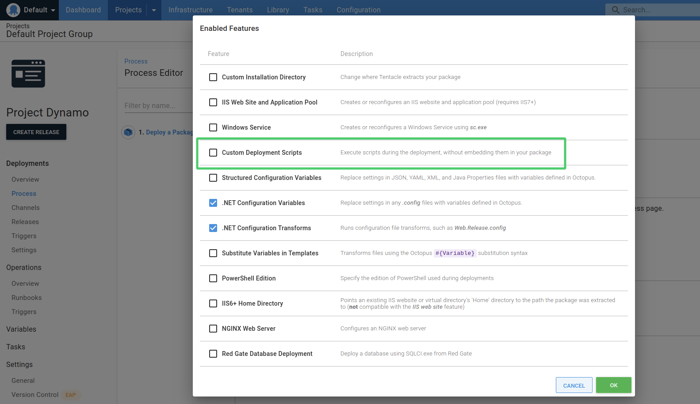
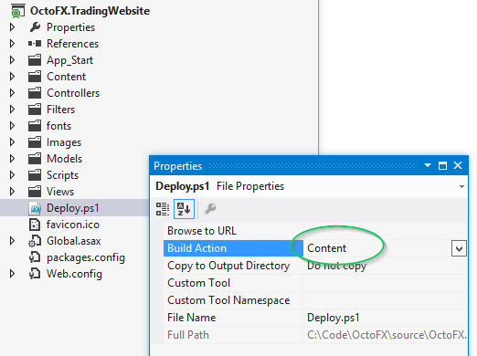

When deploying a package, you can hook into the deployment process at different stages to perform custom actions. You do this by adding specially named scripts at the root of your package.

## Supported scripts

You can add any of the following script files in any of the scripting languages supported by Octopus to your packages:

- `PreDeploy.<ext>`
- `Deploy.<ext>`
- `PostDeploy.<ext>`
- `DeployFailed.<ext>`

Where `<ext>` is the appropriate extension for your scripting language of choice. Also note these file names will be case sensitive on certain operating systems.

Octopus will detect these scripts and invoke them at the appropriate time during the step. Which file you use depends on when you need your custom activity to run; see the section on [what order are conventions run in](/docs/deployments/packages/package-deployment-feature-ordering.md) for details. Your scripts can do anything your scripting language supports, as well as setting [output variables](/docs/projects/variables/output-variables.md) and [collecting artifacts](docs/projects/deployment-process/artifacts.md).

## Supported steps

The following steps have been designed to support running scripts; either at the root of a package, [inline](#scripts-in-package-steps) or both:

- Deploy to IIS
- Deploy a Windows Service
- Deploy a Package
- Deploy an Azure Web App
- Deploy an Azure App Service
- Deploy an Azure Resource Manager template
- Deploy a Service Fabric App
- Deploy to NGINX
- Deploy Java Archive
- Deploy a VHD image
- Deploy to Tomcat via Manager
- Deploy to Wildfly or EAP
- Upgrade a Helm Chart

However, not all package steps support script hooks. As a general rule, any of the [built-in step templates](/docs/projects/built-in-step-templates/index.md) or [community step templates](/docs/projects/community-step-templates.md) that have the `Custom Deployment Scripts` feature available in the [configuration features](/docs/projects/steps/configuration-features/index.md) dialog support script hooks:

:::hint
**Note:** The `Custom Deployment Scripts` feature only needs to be enabled if you want to [define your scripts inline](#scripts-in-package-steps) instead of executing scripts at the root of a package.
:::

## Including the scripts in the package

1. Create the scripts you want Octopus to execute during the step.
2. Name each script to match the naming convention depending when you want the script to execute.
3. Include these scripts at the root of your package. Octopus does not search subdirectories.

## Running a script when a step fails

You can create a file named `DeployFailed.<ext>`, which will be invoked if the step fails. Our blog post about this feature [describes how DeployFailed.<ext> works](https://octopus.com/blog/deployfailed).

## How Octopus executes your scripts

At each stage during the deployment, Octopus will look for a scripts matching the current stage, and execute the first matching script it finds ordered by a platform-specific priority (see [cross-platform support](#cross-platform-support)).

1. Octopus extracts the package to new uniquely named directory. **This becomes the current working directory.**
2. Octopus does some work, then executes `PreDeploy.<ext>` in the current working directory.
3. Optional: If you are using the [custom installation directory feature](/docs/projects/steps/configuration-features/custom-installation-directory.md), Octopus will copy the contents of the current working directory to the custom installation directory. **This becomes the current working directory.**
4. Octopus does some work, then executes `Deploy.<ext>` in the current working directory.
5. Octopus does some work, then executes `PostDeploy.<ext>` in the current working directory.

For more details see [how packages are deployed](/docs/deployments/packages/index.md) and [what order are conventions run in](/docs/deployments/packages/package-deployment-feature-ordering.md).

### Cross-platform support {#cross-platform-support}

If you are deploying the same package to multiple platforms, you can:

1. Use a single scripting language common to all platforms. Octopus will run the single script using the same scripting runtime on all platforms.
2. Use the scripting language most native to each platform. Octopus will run the most appropriate script for each platform using a platform-specific priority order.

The platform-specific priority order Octopus uses to select scripts is:

- Linux: Bash, Python, C#, F#, Powershell
- Windows: Powershell, Python, C#, F#, Bash

Example: You are deploying an application to both Windows and Linux. You can write a single `PreDeploy.py` python script, making sure the python runtime is installed on both platforms. Alternatively, you can write both `PreDeploy.sh` and `PreDeploy.ps1`, and Octopus will run the Bash script on Linux and the PowerShell script on Windows.

## Disabling this convention

You can prevent Octopus from automatically running scripts in packages by adding the `Octopus.Action.Package.RunScripts` variable to your project and setting it to `false`. You can scope the value of this variable to suit your needs.

## Defining your scripts inline {#scripts-in-package-steps}

Rather than embed scripts in packages, you can also define scripts within the step definition using the Octopus user interface. This is a feature that can be enabled on certain steps by clicking **CONFIGURE FEATURES** and selecting **Custom Deployment Scripts**.

When enabled, you will see **Custom Deployment Scripts** under the features section of the process definition.

## Troubleshooting

Make sure the scripts are located in the root of your package.

Make sure the scripts are actually included in your package. Extract your package and inspect the contents to make sure the scripts are included as you expect. For example, if you are using OctoPack for an ASP.NET web application, you'll need to make sure the file is marked as **Build Action = Content**.

If you are using OctoPack to package a Windows Service or console application, set **Copy to Output Directory** = **Copy if newer**.

Read more about [using OctoPack](/docs/packaging-applications/create-packages/octopack/index.md).

If the scripts in your package are still not running, make sure someone has not set a project variable called `Octopus.Action.Package.RunScripts` to `false` for the step where the scripts should run.