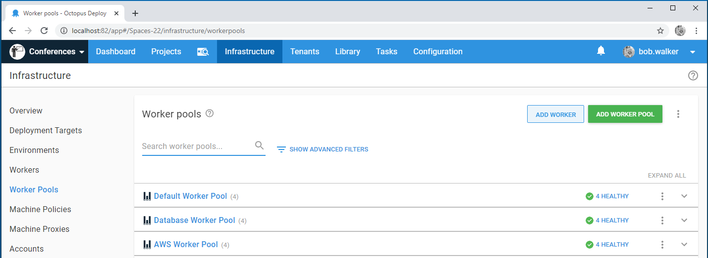
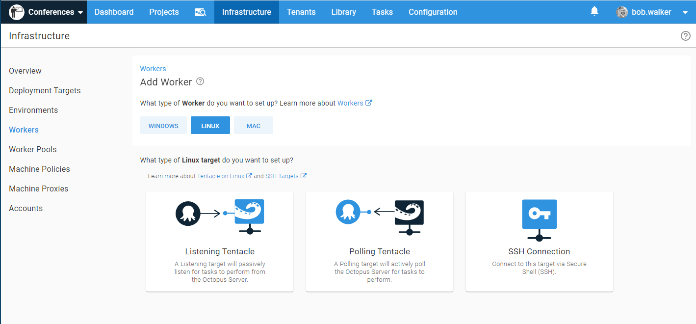
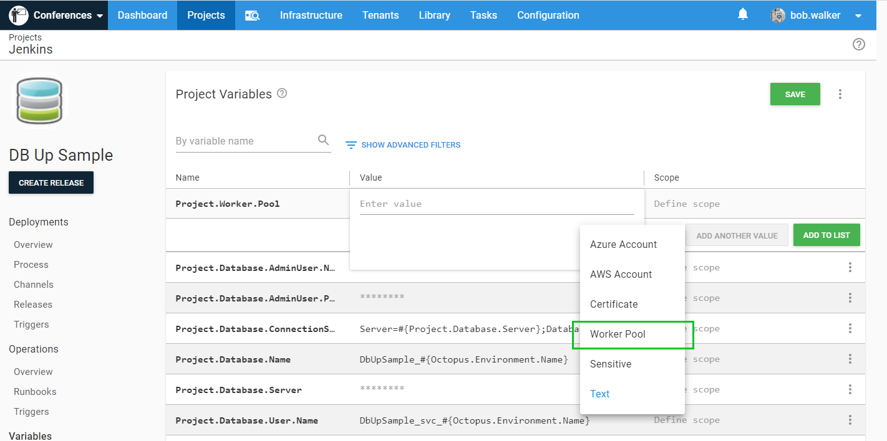
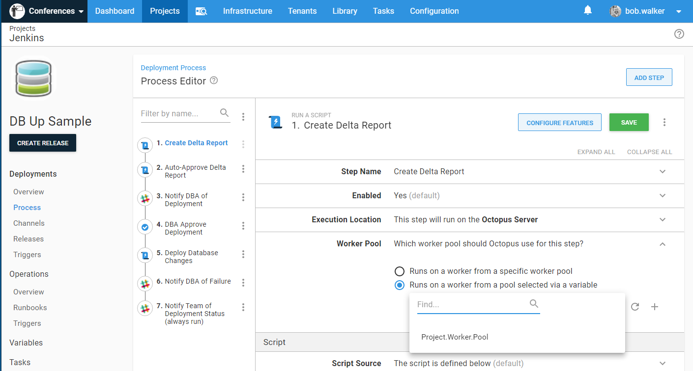
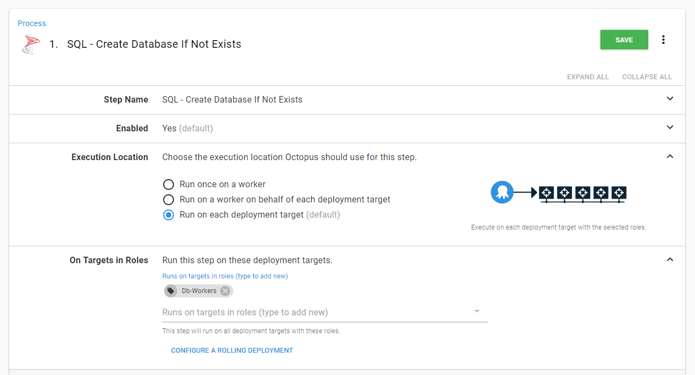
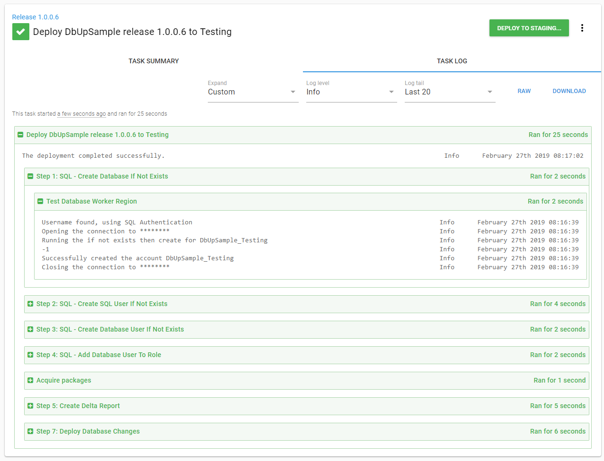
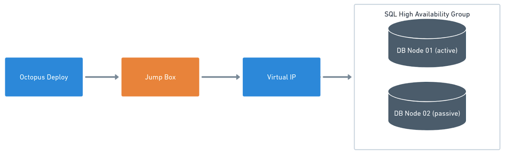

Do not install Tentacles directly on your database servers, instead, use [Workers](/docs/infrastructure/workers/) or install Tentacles on jump boxes for database deployments.

High-availability groups or clusters have 1 to N nodes, and the nodes are kept in sync by replication.  You only need to deploy to the primary node, and replication will apply the changes to all the nodes.  Installing a Tentacle on each node will not work as Octopus Deploy will see multiple Tentacles and attempt to deploy to multiple nodes.

SQL PaaS, such as [AWS RDS](https://aws.amazon.com/rds/) and [Azure's SQL](https://azure.microsoft.com/en-us/services/sql-database/), are hosted database servers that don't allow anything to be installed on them.

Don't use the Tentacles on your web or application servers.  A recommended security practice is the principle of least privilege. The account used by the website to connect to the database server should have restricted permissions. For example, the website uses stored procedures; the account would only have permissions to execute those stored procedures. Whereas, the account used for deployments needs elevated permissions because that account needs to make schema changes.

**Please note:** This document only covers the infrastructure side of database deployments.  You still need to configure a [project](/docs/projects/) in Octopus Deploy to handle the actual deployments.  

## Workers

We recommend using [Workers](/docs/infrastructure/workers/) to handle all of your database deployments.  Workers have several advantages:

1. You can run multiple deployments on them at the same time.
2. You can place multiple VMs into a worker pool.  If a VM goes down during a deployment, another VM would step in and take it's place.

:::hint
Workers were added in Octopus **2018.7.0.**
:::

### General Worker pool configuration

We recommend having separate Worker pools per deployment type. 

Out of the box, the Worker in the default Worker pool is your Octopus Server, and we don't recommend running database deployments from your Octopus Server directly for the following reasons:

1. You often need to install additional tooling or SDKs unrelated to Octopus Deploy.
2. The database deployment tools might need to run on Linux while Octopus Deploy is running on Windows.
3. It can slow down other deployments because the Octopus Server will allocate resources for database deployments in addition to everything else.

:::hint
A worker can be assigned to more than one pool.
:::

To create a new worker pool, go to **{{Infrastructure,Worker Pools}}** and then click on the **Add Worker Pool** button:

In the modal dialog, add the name of the worker pool you wish to add:

Once you click the **Save** button, you will be presented with the Worker Pool maintenance screen.  Your options are:

- Name: The name of the worker pool.
- Default: Indicates if this is the default Worker pool.  **Warning:** Changing this may lead to failed builds, as all tasks previously done in the old default pool will now be done on this pool. 
- Description: A brief description of the Worker pool.

When you add a worker to the pool, you are given a choice of listening, polling, and in the case of Linux, SSH:

### Using Worker pools in a deployment process

After you've added a Worker pool, a new option will appear in the deployment process, giving you the option to run once on a Worker, and which Worker pool should be used.

:::hint
Certain steps do not let you to pick a Worker pool.  That list includes **Deploy to IIS**, **Deploy a Windows Service**, and **Deploy a Package**.  If you are using a step template that relies on that functionality, you need to use [jump boxes](#tentacles-on-a-jump-box).
:::

### Worker pool per environment after Octopus Deploy 2020.1

A common security practice is to leverage Active Directory service accounts.  But each environment has its own service account.  The account that deploys to **Development** is prevented from deploying to **Test**.  The account that deploys to **Production** is prevented from deploying to **Development**.  This is accomplished with integrated security and running the Octopus Tentacle [as a specific user account](/docs/infrastructure/deployment-targets/tentacle/windows/running-tentacle-under-a-specific-user-account/).  This approach needs a Worker pool per environment:

To start, create a dedicated Worker pool for each environment:

In your project variables, or in your variable set, create a new variable.  Click the **Change Type** option and select **Worker Pool**:

Select the Worker pool:

With that option, you can scope Worker pools to specific environments:

In the deployment process, a new option has appeared under Worker pool **Runs on a worker from a pool selected via a variable**.  Update the desired steps to use that variable:

### Worker pool per environment before Octopus Deploy 2020.1

If you are using a version of Octopus Deploy prior to 2020.1, the process is slightly different. To start, create a dedicated Worker pool for each environment:

Next, create cloud region deployment targets (a cloud region is a group of deployment targets).

:::hint
Cloud region deployment targets do not count against your license.
:::

Create a cloud region for each environment.  In this example, a new role called `DbWorker` was created for these cloud regions. This will help differentiate these new deployment targets.  Make a note of the Worker pool for that cloud region, and select the one that matches your environment of choice:

When done, you will have a cloud region per environment:

The execution location will now be a target role, which is why the `DbWorker` role was created.  That tells the deployment to use the new cloud region.  The cloud region will use the Worker pool:

That step needs to be repeated for each step in the process:

When a release is performed, it will use the environment-specific Worker pool.  In the example below, a new release to the **Test** environment was done using the **Test Database Worker Region**:

### Database deployments with Tentacles on a jump box {#tentacles-on-a-jump-box}

If you are using an older version of Octopus Deploy, or your license limits you to one worker, then you need to install Tentacles on a jump box.  The jump box sits between Octopus Deploy and the Database Server VIP.  The Tentacle is running as a [service account](/docs/infrastructure/deployment-targets/tentacle/windows/running-tentacle-under-a-specific-user-account/) with the necessary permissions to make schema changes.  The tooling you chose for database deployments is installed on the jump box:

In the event of multiple domains, a jump box is needed per domain.  This might be seen where there is a domain in local infrastructure and another domain in a cloud provider such as Azure. As long as port 10933 is open (for a listening Tentacle) or port 443 (for a polling Tentacle) Octopus will be able to communicate to the jump box.

It is possible to install many Tentacles on a single server.  Please [managing multiple instances](/docs/administration/managing-infrastructure/managing-multiple-instances/) for more information.  

