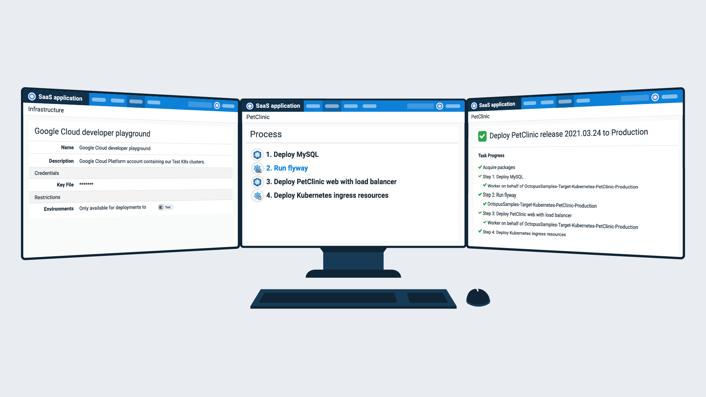

Octopus Deploy makes it easy to manage your Kubernetes resources, whether you're starting simple or want complete control over a complex setup. You can deploy Kubernetes resources such as [deployments](/docs/deployments/kubernetes/deploy-container/index.md), [services](/docs/deployments/kubernetes/deploy-service/index.md), and [ingress](/docs/deployments/kubernetes/deploy-ingress/index.md), and run scripts against a Kubernetes cluster.

- Centralize your Kubernetes clusters and resources in a single place so you can focus on your applications and customers
- Adopt development best practices:
  - Deploy to development, test, and production environments with automatic configuration updates ([variable substitution](/docs/projects/variables/variable-substitutions.md))
  - Use built-in service accounts for simple and secure authentication
  - Implement deployment patterns like blue/green, canary, and rolling deployments
- Automate routine maintenance and respond more quickly to emergencies:
  - Octopus [runbooks](/docs/runbooks/index.md) and [projects](/docs/projects/index.md) share the same variables and accounts to interact with your clusters
  - Use pre-approved [kubectl](/docs/deployments/kubernetes/kubectl/index.md) scripts

## Get started with Kubernetes and Octopus or manage a complex setup

Our Kubernetes automation supports three approaches:

1. A structured UI step that guides you through the configuration without any YAML input
2. A fully flexible step configured with raw YAML
3. Helm chart automation steps

All three methods:

- Are compatible with runbooks, [environments](/docs/infrastructure/environments/index.md), and shared variables in Octopus
- Include robust config file support for repeatable and reliable deployments across multiple environments

### Structured UI step without YAML input

If you're getting started with Kubernetes, we recommend the structured UI step. Octopus prompts you for the required properties and provides deep links to the official Kubernetes documentation so you can learn how Kubernetes works.

### Raw YAML step

The raw YAML step allows you to configure Kubernetes manually, leveraging the full power of Octopus features to support your setup. This approach is more flexible and gives you complete control over the YAML but requires deeper knowledge of Kubernetes configuration.

You can also edit the YAML underlying the UI step if you find it faster or more convenient. This also makes it easy to upgrade to the raw YAML step if you outgrow the UI approach.

### Helm chart automation steps

Helm is the de facto Kubernetes package manager, so our [Helm chart steps](/docs/deployments/kubernetes/helm-update/index.md) are a popular option. Again, you have the full power of Octopus at your disposal, but there's less raw YAML to configure.

## Kubernetes targets

Kubernetes targets are used by the Kubernetes steps to define the context in which deployments and scripts are run. Learn how to configure [Kubernetes deployment targets](/docs/infrastructure/deployment-targets/kubernetes-target/index.md).

## Learn more

- Generate an Octopus guide for [Kubernetes and the rest of your CI/CD pipeline](https://octopus.com/docs/guides?destination=Kubernetes)
- [Kubernetes blog posts](https://octopus.com/blog/tag/kubernetes)
