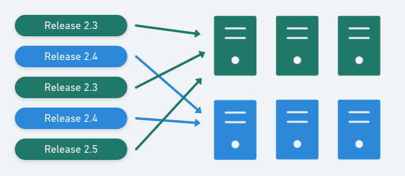

Blue-green deployments are a pattern whereby we reduce downtime during production deployments by having two separate production environments ("blue" and "green").

> One of the challenges with automating deployment is the cut-over itself, taking software from the final stage of testing to live production. You usually need to do this quickly in order to minimize downtime. The **blue-green deployment** approach does this by ensuring you have two production environments, as identical as possible. At any time one of them, let's say blue for the example, is live. As you prepare a new release of your software you do your final stage of testing in the green environment. Once the software is working in the green environment, you switch the router so that all incoming requests go to the green environment - the blue one is now idle.
>
> - [Martin Fowler](http://martinfowler.com/bliki/BlueGreenDeployment.html)

In a blue-green deployment model, the production environment changes with each release:

As well as reducing downtime, Blue-Green can be a powerful way to use extra hardware compared to having a dedicated staging environment:

- Staging: when blue is active, green becomes the staging environment for the next deployment.
- Rollback: we deploy to blue and make it active. Then a problem is discovered. Since green still runs the old code, we can roll back easily.
- Disaster recovery: after deploying to blue and we're satisfied that it is stable, we can deploy the new release to green too. This gives us a standby environment ready in case of disaster.

## Learn More

- [Change load-balancer group Runbook example](/docs/runbooks/runbook-examples/aws/change-load-balancer-group/).