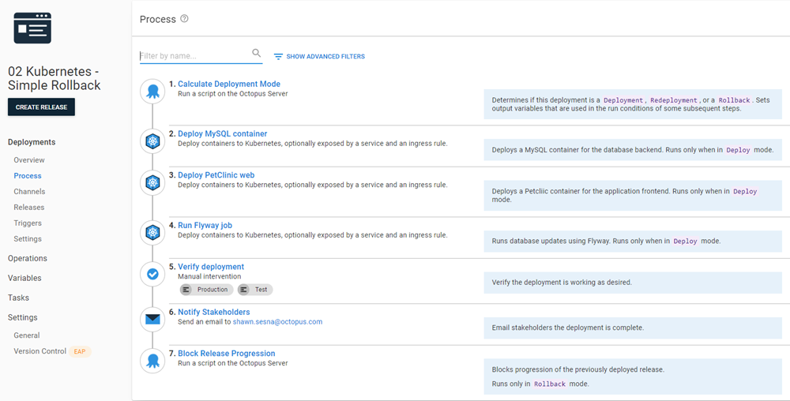

This guide will walk through rolling back a Kubernetes Deployment.  The example application used in this guide is a containerized version of [PetClinic](https://bitbucket.org/octopussamples/petclinic/src/master/) that will create the following pods:
- MySQL database container for the backend (deployment)
- Flyway database migrations container (job)
- PetClinic web frontend container (deployment)

Database rollbacks are out of scope for this guide; refer to this [article](https://octopus.com/blog/database-rollbacks-pitfalls), which discusses methods of database rollbacks and when they are appropriate.

## Existing deployment process
For this guide, we'll start with an existing deployment process for deploying PetClinic to a Kubernetes cluster:

1. Deploy MySQL Container
1. Deploy PetClinic web
1. Run Flyway job
1. Verify the deployment
1. Notify stakeholders


:::success
View that deployment process on [samples instance](https://samples.octopus.app/app#/Spaces-762/projects/01-kubernetes-original/deployments/process).  Please login as a guest.
:::

## Zero Configuration Rollback
!include <zero-configuration-rollback>

## Simple Rollback Process
The most common reason for a rollback is something is wrong with the release.  In these cases, you'll want to block the bad release from [moving forward](/docs/releases/prevent-release-progression.md).

The updated deployment process for a simple rollback would look like this:

1. Calculate Deployment Mode
1. Deploy MySQL Container (skip during rollback)
1. Deploy PetClinic web
1. Run Flyway job (skip during rollback)
1. Verify the deployment
1. Notify stakeholders
1. Block Release Progression (only during rollback)



:::success
View that deployment process on [samples instance](https://samples.octopus.app/app#/Spaces-762/projects/02-kubernetes-simple-rollback/deployments/process).  Please login as a guest.
:::

### Calculate Deployment Mode
!include <calculate-deployment-mode>

### Skipping database steps
Deploying the MySQL container and running the Flyway job should be skipped in a rollback scenario.  For this guide, we're going to assume that the deployment of the MySQL container wasn't the cause for the rollback.  As previously stated, database rollbacks are out of scope for this guide, so we'll skip the Flyway Job container as well.

To ensure that both of those steps are not run during a rollback, use the following output variable from the `Calculate Deployment Mode` step as the Variable Run condition.

```text
#{Octopus.Action[Calculate Deployment Mode].Output.RunOnDeploy}
```

:::hint
When viewing the deployment process at a glance, it is not readily apparent that a step has a run condition associated with it.  Octopus Deploy provides a `Notes` field for each step where you can add information such as in which conditions the step will run as a way of self-documentation.
:::

### Block Release Progression

!include <prevent-release-progression>

## Complex Rollback Process
A feature of Kubernetes is the revision history of the cluster components.  The command `kubectl rollout history deployment.v1.apps/<deploymentname>` lists all deployment revisions.

```text
REVISION  CHANGE-CAUSE
1         <none>
2         <none>
3         <none>
```

Using this feature, we can create a rollback process that would allow us to roll back quickly.

The new deployment process would look like this:

1. Calculate Deployment Mode
1. Rollback Reason (only during rollback)
1. Deploy MySQL Container (skip during rollback)
1. Deploy PetClinic web
1. Run Flyway job (skip during rollback)
1. Verify the deployment
1. Notify stakeholders
1. Rollback to the previous version for PetClinic Web (only during rollback)
1. Block Release Progression (only during rollback)


:::success
View that deployment process on [samples instance](https://samples.octopus.app/app#/Spaces-762/projects/03-kubernetes-complex-rollback/deployments/process).  Please login as a guest.
:::

Next, we'll go through the newly added and altered steps:

### Rollback reason
This is a [Manual Intervention](/docs/projects/built-in-step-templates/manual-intervention-and-approvals.md) step that prompts the user for the reason they are rolling back.  The text entered is stored in an output variable which will be used in the Block Release Progression step further down the process.

### Deploy PetClinic Web
The revision history command for Kubernetes showed that there were multiple revisions stored within Kubernetes for deployment.  However, it's not obvious as to which revision belongs to which Octopus release.  Adding a `kubernetes.io/change-cause` annotation to the `Deploy PetClinic Web` step would add the Octopus Release Number as the `change-cause` so we could later parse it for which revision to roll back to.


Running `kubectl rollout history deployment.v1.apps/<deploymentname>` would now show something like this.

```text
REVISION  CHANGE-CAUSE
1         2021.09.23.0
2         2021.09.23.1
3         2021.09.23.2
```

### Rollback to the previous version for Petclinic Web
Using the annotation from the `Deploy PetClinic Web`, we can use the following script to identify the revision we want to roll back to and perform the rollback using the built-in functionality of Kubernetes.  This step uses the `Run a Kubectl CLI Script` step with the following code.

```powershell
# Init variables
$k8sRollbackVersion = 0
$rollbackVersion = $OctopusParameters['Octopus.Release.Number']
$namespace = $OctopusParameters['Project.Namespace.Name']
$deploymentName = $OctopusParameters['Project.Petclinic.Deployment.Name']

# Get revision history
Write-Host "Getting deployment $deploymentName revision history ..."
$revisionHistory = (kubectl rollout history deployment.v1.apps/$deploymentName -n $namespace)
$revisionHistory = $revisionHistory.Split("`n")

# Loop through history starting at index 2 (the first couple of lines aren't versions)
Write-Host "Searching revision history for version $rollbackVersion ..."
for ($i = 2; $i -lt $revisionHistory.Count - 1; $i++)
{
    # Split it into two array elements
    $revisionSplit = $revisionHistory[$i].Split(" ", [System.StringSplitOptions]::RemoveEmptyEntries)
    
    # Check version
    if ($revisionSplit[1] -eq $rollbackVersion)
    {
        # Record version index
        Write-Host "Version $rollbackVersion found!"
        $k8sRollbackVersion = $revisionSplit[0]
        
        # Get out of for
        break
    }
}

# Check to see if something was found
if ($k8sRollbackVersion -gt 0)
{
    # Issue rollback
    Write-Host "Rolling Kubernetes deployment $deploymentName to revision $k8sRollbackVersion ..."
    kubectl rollout undo deployment.v1.apps/$deploymentName -n $namespace --to-revision=$k8sRollbackVersion
}
else
{
    Write-Error "Version $rollbackVersion not found in the cluster revision history."
}
```
### Block Release Progression
The `Rollback Reason` step captures the reason for the rollback.  We can pass the text entered in this step to the `Reason` field of this step by using the following output variable.

```text
#{Octopus.Action[Rollback reason].Output.Manual.Notes}
```

## Choosing a rollback strategy
It is our recommendation that you start with the simple rollback strategy, moving to the complex if you determine that the simple method doesn't suit your needs.