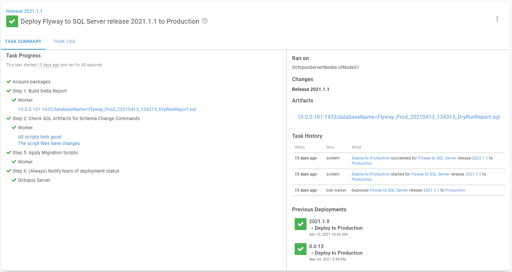

Deployment and runbook processes are the series of steps you specify to either deploy or manage your application.  The difference between a deployment and a runbook is the intended usage:

- A deployment process contains all the necessary steps to deploy your software to your deployment targets.  A project can have 0 to 1 deployment processes.
- A runbook process contains all the necessary steps to manage your software (restart a service, backup files, configure infrastructure, etc.) on your deployment targets.  A project can have 0 to N runbook processes.

Aside from the intended usage, there is little difference between a deployment process and a runbook process.  Both can use the same steps.  Both can scope steps to run on specific environments.  Because of that, this section can apply to both the runbooks and deployment processes.

When you run a runbook or do a deployment, all the output is written to the Task Log.  

The top of the task log allows you to change the information shown.  
- By default, the log level is set to Info, which means only Info, Warnings, and Errors messages are shown.  Changing to Verbose will show all messages.
- By default, the screen will only show the 20 most recent messages for each step.  Changing the log tail to all will show all messages.
- Clicking on the **RAW** button will show you all the messages without any formatting.
- Clicking on the **Download** button will download the entire log.

The task log represents the deployment or runbook run details but is typically useful when debugging. The majority of the time will be spent in the Task Summary as it provides an overview of the deployment or runbook run.

The summary includes:
- List of all steps and any important messages.
- The task history, which includes who triggered it and when it was triggered.
- The list of previous deployments to this environment for this project.
- A list of [artifacts](/docs/projects/deployment-process/artifacts.md) generated by the process.

## Task Logs vs. Artifacts

It is essential to understand the difference between artifacts and task logs.

- The task log is a log of the deployment or runbook run.  You should write to that when you want to give status updates to users of the deployment.
- Artifacts are files generated by a specific step containing valuable data for users to download and review.  Examples include test run results, delta script reports, and configuration files.

Both the task log and artifacts can be downloaded; there is no need to create artifacts from the log messages.

## Logging

You can never have too much logging when running custom PowerShell, Python, or Bash scripts in your deployment or runbook process.  

[Octopus Deploy](/docs/deployments/custom-scripts/logging-messages-in-scripts.md) supplies built-in logging utilities you can leverage in your scripts.  This is one of the few areas where it is okay to directly reference these functions instead of passing them in as parameters.

We also recommend leveraging the different logging levels as Octopus treats each one differently.

- Verbose: Automatically hidden by default, useful for low-level logging messages you think will only be helpful to other developers.
- Information: This is shown in the task log by default.  Useful for logging status messages to the user.
- Warning: Messages are highlighted in yellow in the task log. Helpful if something isn't quite right, but the script was able to recover.
- Error: Messages are highlighted in red in the task log and task summary.  This message type is for what it says on the tin, error messages.
- Highlight: Messages are highlighted in blue in the task log and task summary.  Use these for important messages you want to let the user know about. 

Putting information required for approvals in a log file can make it difficult to find.  Consider artifacts as an alternative.

## Step naming and descriptions

We recommend having clear, concise names for your steps.  The step name is what appears in the task summary and task log.  

By default, Octopus Deploy will only run a step if the previous step is successful.  You can override that behavior, so it always runs, only runs on failure, or runs on a variable condition.  If you override that default behavior, then the name should include that in the step name. 

Starting in **Octopus Deploy 2020.5**, you can add a description field to each step.  We highly recommend using that to help other users of your deployment process understand what each step is doing.

An example representing the deployment process is:

## Running a runbook from a deployment

With the [Run Octopus Deploy Runbook step template](https://library.octopus.com/step-templates/0444b0b3-088e-4689-b755-112d1360ffe3/actiontemplate-run-octopus-deploy-runbook), you can trigger a runbook run from a deployment.  We recommend doing this when you need to perform non-deployment maintenance tasks.  Some examples include:

- Ensuring all the deployment targets have the necessary software installed (node.js, JRE, etc.).
- Spinning up or down new testing infrastructure.
- Backing up a database before deployment.
- Creating a test database after deployment for developers to use locally.

## Consistent Processes for all environments

The deployment and runbook processes should be the same for all environments, except for a step or two enabled or disabled.  In other words, if you are deploying to a Kubernetes cluster in **production**, you should deploy to a Kubernetes cluster in your testing environments.  Don't deploy to VMs in your testing environments and then to something else in your **production** environments.  Having different destination architectures means there is no guarantee of knowing if the process will work until you deploy to **production**.

## Use Output Variables to control flow

When defining your runbook or deployment process, you can configure a run condition based on a variable.  Generally, that feature is used to skip over a specific step when a particular condition occurs.  For example, skip over a testing step if only .css or image files were deployed.

Octopus Deploy provides an [extended variable syntax](/docs/projects/variables/variable-substitutions.md#VariableSubstitutionSyntax-ExtendedSyntax) that includes support for if/elseif/else/then statements.  While it is possible to have a complex if/then statement in run condition, we don't recommend it.  Instead, we recommend you run a script and set an [output variable](/docs/projects/variables/output-variables.md).  Use that output variable in the run condition.  Having the decision made in a script means you can easily test and debug it. 

## Further reading

For further reading on deployment and runbook processes in Octopus Deploy please see:

- [Deployment Patterns](/docs/deployments/patterns/index.md)
- [Runbooks vs Deployments](/docs/runbooks/runbooks-vs-deployments/index.md)
- [Runbook Examples](/docs/runbooks/runbook-examples/index.md)

<a class="btn btn-secondary" href="/docs/getting-started/best-practices/users-roles-and-teams">Previous</a>&nbsp;&nbsp;&nbsp;&nbsp;&nbsp;<a class="btn btn-success" href="/docs/getting-started/best-practices/releases-and-deployments">Next</a>
