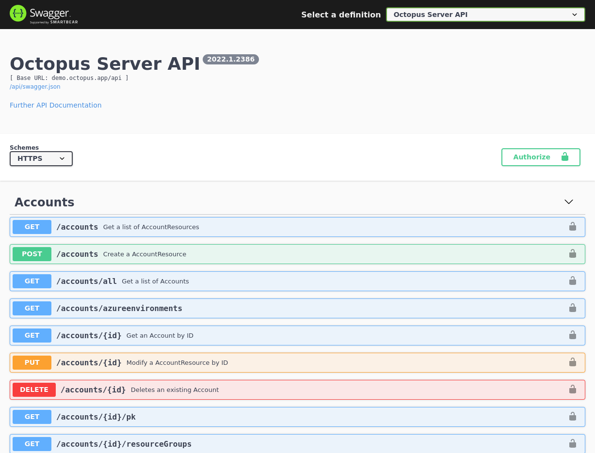

!include <rest-api>

The Octopus REST API is designed:

1. To be friendly and easy to figure out.
2. To be [hypermedia driven](http://en.wikipedia.org/wiki/HATEOAS), using links and the occasional [URI template](http://tools.ietf.org/html/rfc6570) ([read more](#api-links)).
3. To be comprehensive - 100% of the actions that you perform via the Octopus UI can be performed via the API.
4. To provide a great developer experience through [API clients](#api-clients) and [detailed examples](/docs/octopus-rest-api/examples/).

## API Clients

Octopus provides API clients for popular programming languages and runtime environments. The source code for these clients is hosted on GitHub:

- [Go API Client for Octopus Deploy](https://github.com/OctopusDeploy/go-octopusdeploy)
- [Java API Client for Octopus Deploy](https://github.com/OctopusDeployLabs/java-octopus-deploy)
- [.NET C# API Client for Octopus Deploy](https://github.com/OctopusDeploy/OctopusClients)
- [TypeScript API Client for Octopus Deploy](https://github.com/OctopusDeploy/api-client.ts)

Code snippets using these clients for various operations in the Octopus REST API are available in our [API examples](/docs/octopus-rest-api/examples/) documentation.

## REST API Authentication {#authentication}

The Octopus Deploy API is available at:

```
https://<your-octopus-url>/api
```

Replacing `<your-octopus-url>` with the URL that you host your Octopus instance on.

You'll need an API key to access the API. You can get your API key from your profile page on the Octopus Web Portal. 

Once you have a key, you can provide it to the API in the following ways:

1. Through the `X-Octopus-ApiKey` HTTP header with all requests. This is the preferred approach.
1. As an `apikey` query string parameter with all requests. This should only be used for simple requests.

:::hint
Learn more about [how to create an API key](/docs/octopus-rest-api/how-to-create-an-api-key/).
:::

## REST API Swagger Documentation {#api-swagger-docs}

Octopus includes the default Swagger UI for displaying the API documentation in a nice human readable way. To browse that UI just open your browser and go to `https://<your-octopus-url>/swaggerui/`. The original Non-Swagger API page is still available and can always be accessed via `https://<your-octopus-url>/api/`.



You can view the API through the Octopus Demo server at [demo.octopus.app/swaggerui/index.html](https://demo.octopus.app/swaggerui/index.html).

## REST API Links {#api-links}

All resources returned by the REST API contain links to other resources. The idea is that instead of memorizing or hard-coding URL's when using the API, you should start with the root API resource and use links to navigate. 

For example, a `GET` request to `/api` returns a resource that looks like:

```json  
{
    "Application": "Octopus Deploy",
    "Version": "2022.1.2386",
    "ApiVersion": "3.0.0",
    "InstallationId": "9f155416-5d9e-4e19-ba58-b710d4edf336",
    "Links": {
        "Self": "/api",
        "Accounts": "/api/Spaces-1/accounts{/id}{?skip,take,ids,partialName,accountType}",
        "Environments": "/api/Spaces-1/environments{/id}{?name,skip,ids,take,partialName}",
        "Machines": "/api/Spaces-1/machines{/id}{?skip,take,name,ids,partialName,roles,isDisabled,healthStatuses,commStyles,tenantIds,tenantTags,environmentIds,thumbprint,deploymentId,shellNames,deploymentTargetTypes}",
        "Projects": "/api/Spaces-1/projects{/id}{?name,skip,ids,clone,take,partialName,clonedFromProjectId}",
        "RunbookProcesses": "/api/Spaces-1/runbookProcesses{/id}{?skip,take,ids}",
        "RunbookRuns": "/api/Spaces-1/runbookRuns{/id}{?skip,take,ids,projects,environments,tenants,runbooks,taskState,partialName}",
        "Runbooks": "/api/Spaces-1/runbooks{/id}{?skip,take,ids,partialName,clone,projectIds}",
        "RunbookSnapshots": "/api/Spaces-1/runbookSnapshots{/id}{?skip,take,ids,publish}",
        "Feeds": "/api/feeds{/id}{?skip,take,ids,partialName,feedType,name}",
        "Tasks": "/api/tasks{/id}{?skip,active,environment,tenant,runbook,project,name,node,running,states,hasPendingInterruptions,hasWarningsOrErrors,take,ids,partialName,spaces,includeSystem,description,fromCompletedDate,toCompletedDate,fromQueueDate,toQueueDate,fromStartDate,toStartDate}",
        "Variables": "/api/Spaces-1/variables{/id}{?ids}",
        "Web": "/app"
    }
}
```
:::hint
Note: the `Links` collection example above has been significantly reduced in size for demonstration purposes.
:::

You can follow the links in the result to navigate around the API; for example, by following the `Projects` link, you'll find a list of the projects on your Octopus server. 

Since the format and structure of links may change, it's essential that clients avoid hardcoding URL's to resources, and instead rely on starting at `/api` and navigating from there. 

### URI Templates

Some links (mainly to collections) use URI templates as defined in [RFC 6570](http://tools.ietf.org/html/rfc6570). If in doubt, a client should assume that any link is a URI template.

### Collections

Collections of resources also include links. For example, following the `Environments` link above will give you a list of environments. 

```json
{
    "ItemType": "Environment",
    "TotalResults": 20,
    "ItemserPage": 10,
    "NumberOfPages": 2,
    "LastPageNumber": 1,
    "Items": [
        // ... a list of environments ...
    ],
    "Links": {
        "Self": "/api/Spaces-1/environments?skip=0&take=10",
        "Template": "/api/Spaces-1/environments{?skip,ids,take,partialName}",
        "Page.All": "/api/Spaces-1/environments?skip=0&take=2147483647",
        "Page.Next": "/api/Spaces-1/environments?skip=10&take=10",
        "Page.Current": "/api/Spaces-1/environments?skip=0&take=10"
    }
}
```

The links at the bottom of the resource allow you to traverse the pages of results. Again, instead of hard-coding query string parameters, you can look for a `Page.Next` link and follow that instead. 

## REST API and Spaces {#api-and-spaces}

If you are using spaces, you need to include the `SpaceID` in your API calls. If you do not include the `SpaceID`, your API calls will automatically use the default space.

## REST API code samples {#api-samples}

Code snippet samples for various operations in the Octopus REST API are available both in our [API examples](/docs/octopus-rest-api/examples/) and on the [OctopusDeploy-API GitHub repository](https://github.com/OctopusDeploy/OctopusDeploy-Api)
