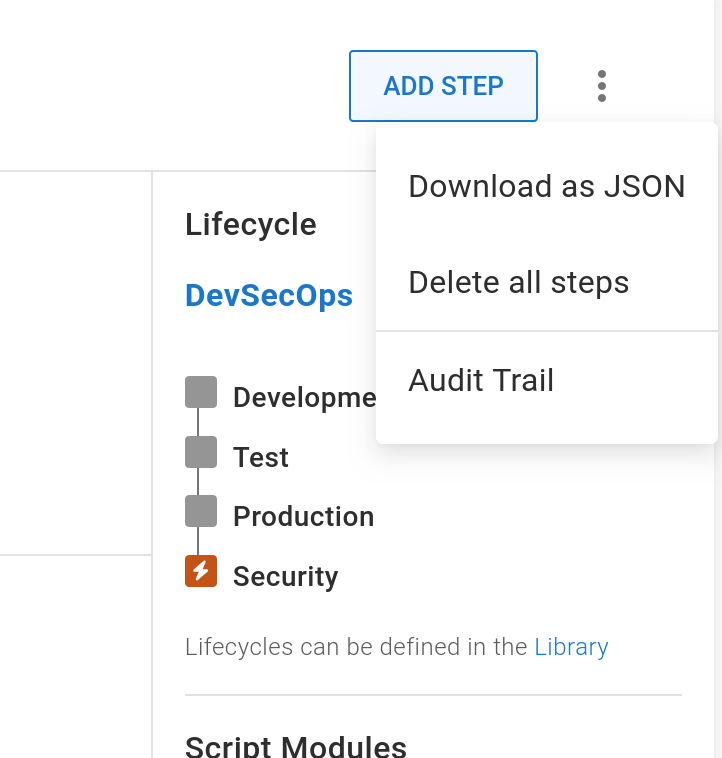

Octopus is conceptually split into two types of resources:

1. Space level resources such as environments, feeds, accounts, lifecycles, certificates, workers, worker pools, and library variable sets
2. Project level resources such as the projects themselves, the project deployment process, runbooks, project environments, and project triggers

Space level resources are shared by projects and do not tend to change as frequently as projects.

Managed spaces (i.e. spaces with centrally managed resources) are implemented by deploying space and project level resources as separate process:

* Space level resources are deployed first to support one or more projects
* Project level resources are deployed referencing the space level resources

There are two ways to manage project level resources:

* Define database backed projects, complete with all deployment steps, with Terraform
* Define the configuration of a Config-as-code (CaC) project with Terraform, while deferring the configuration of CaC managed settings like the deployment process, non-secret variables, and some project settings to those stored in Git.

Defining database backed projects in Terraform is useful for centralized responsibility projects where the customer has little or no ability to modify the project, or customer responsibility projects where projects will not be updated after they are created.

Defining CaC projects is useful for shared responsibility projects where deployment processes can be modified by customers and the platform team, with differences reconciled with Git merges.

Project level resources can be defined in a Terraform module in two ways:

* Write the module by hand
* Serialize an existing project to a Terraform module with [octoterra](https://github.com/OctopusSolutionsEngineering/OctopusTerraformExport)

## Writing by hand

Projects can be defined in a Terraform module by hand. The Terraform provider has [tests](https://github.com/OctopusDeployLabs/terraform-provider-octopusdeploy/tree/main/terraform) that can be used as examples for creating your own Terraform module.

However, Octopus steps are typically defined as key/value pairs defined in a property bag. These values are not documented, and the only way to find which combination of values work for a step is to first created the step in the Octopus UI and export the step to JSON:



The resulting JSON file looks something like this, where the `Steps[].Actions[].Properties` field defines the property bag:

```json
{
  "Id": "deploymentprocess-Projects-5222",
  "SpaceId": "Spaces-1913",
  "ProjectId": "Projects-5222",
  "Version": 1,
  "Steps": [
    {
      "Id": "4ce3b678-a928-4456-9af0-6afd741863c0",
      "Name": "Deploy Container",
      "Slug": "deploy-container",
      "PackageRequirement": "LetOctopusDecide",
      "Properties": {
        "Octopus.Action.TargetRoles": "EKS_Reference_Cluster"
      },
      "Condition": "Success",
      "StartTrigger": "StartAfterPrevious",
      "Actions": [
        {
          "Id": "44a23dd7-c320-4836-9ecb-5530a670c1f2",
          "Name": "Deploy Container",
          "Slug": "deploy-container",
          "ActionType": "Octopus.KubernetesDeployContainers",
          "Notes": null,
          "IsDisabled": false,
          "CanBeUsedForProjectVersioning": true,
          "IsRequired": false,
          "WorkerPoolId": "WorkerPools-2259",
          "Container": {
            "Image": "octopuslabs/k8s-workertools",
            "FeedId": "Feeds-3533"
          },
          "WorkerPoolVariable": null,
          "Environments": [
            "Environments-2584",
            "Environments-2582",
            "Environments-2581"
          ],
          "ExcludedEnvironments": [],
          "Channels": [],
          "TenantTags": [],
          "Packages": [
            {
              "Id": "4c88ac9a-3639-4047-9d9d-38adf7949fdb",
              "Name": "web",
              "PackageId": "#{Kubernetes.Deployment.Image}",
              "FeedId": "#{Kubernetes.Deployment.Feed}",
              "AcquisitionLocation": "NotAcquired",
              "Properties": {
                "Extract": "False",
                "PackageParameterName": "",
                "SelectionMode": "immediate"
              }
            }
          ],
          "GitDependencies": [],
          "Condition": "Success",
          "Properties": {
            "Octopus.Action.EnabledFeatures": "Octopus.Features.KubernetesService,Octopus.Features.KubernetesIngress,Octopus.Features.KubernetesConfigMap,Octopus.Features.KubernetesSecret",
            "Octopus.Action.Kubernetes.DeploymentTimeout": "180",
            "Octopus.Action.Kubernetes.ResourceStatusCheck": "True",
            "Octopus.Action.KubernetesContainers.Containers": "[{\"Args\":[],\"Command\":[],\"ConfigMapEnvFromSource\":[],\"ConfigMapEnvironmentVariables\":[],\"CreateFeedSecrets\":\"False\",\"EnvironmentVariables\":[{\"key\":\"PORT\",\"keyError\":null,\"option\":\"\",\"option2\":\"\",\"option2Error\":null,\"optionError\":null,\"value\":\"#{Kubernetes.Deployment.Port}\",\"valueError\":null}],\"FieldRefEnvironmentVariables\":[],\"Lifecycle\":{\"PostStart\":null,\"PreStop\":null},\"LivenessProbe\":{\"exec\":{\"command\":[]},\"failureThreshold\":\"\",\"httpGet\":{\"host\":\"\",\"httpHeaders\":[],\"path\":\"\",\"port\":\"\",\"scheme\":\"\"},\"initialDelaySeconds\":\"\",\"periodSeconds\":\"\",\"successThreshold\":\"\",\"tcpSocket\":{\"host\":\"\",\"port\":\"\"},\"timeoutSeconds\":\"\",\"type\":\"\"},\"Name\":\"web\",\"Ports\":[{\"key\":\"web\",\"keyError\":null,\"option\":\"TCP\",\"option2\":\"\",\"option2Error\":null,\"optionError\":null,\"value\":\"#{Kubernetes.Deployment.Port}\",\"valueError\":null}],\"ReadinessProbe\":{\"exec\":{\"command\":[]},\"failureThreshold\":\"\",\"httpGet\":{\"host\":\"\",\"httpHeaders\":[],\"path\":\"\",\"port\":\"\",\"scheme\":\"\"},\"initialDelaySeconds\":\"\",\"periodSeconds\":\"\",\"successThreshold\":\"\",\"tcpSocket\":{\"host\":\"\",\"port\":\"\"},\"timeoutSeconds\":\"\",\"type\":\"\"},\"Resources\":{\"limits\":{\"amdGpu\":\"\",\"cpu\":\"\",\"ephemeralStorage\":\"\",\"memory\":\"\",\"nvidiaGpu\":\"\",\"storage\":\"\"},\"requests\":{\"amdGpu\":\"\",\"cpu\":\"\",\"ephemeralStorage\":\"\",\"memory\":\"\",\"nvidiaGpu\":\"\",\"storage\":\"\"}},\"SecretEnvFromSource\":[],\"SecretEnvironmentVariables\":[],\"SecurityContext\":{\"allowPrivilegeEscalation\":\"\",\"capabilities\":{\"add\":[],\"drop\":[\"ALL\"]},\"privileged\":\"\",\"readOnlyRootFilesystem\":\"\",\"runAsGroup\":\"\",\"runAsNonRoot\":\"True\",\"runAsUser\":\"\",\"seLinuxOptions\":{\"level\":\"\",\"role\":\"\",\"type\":\"\",\"user\":\"\"}},\"StartupProbe\":{\"exec\":{\"command\":[]},\"failureThreshold\":\"\",\"httpGet\":{\"host\":\"\",\"httpHeaders\":[],\"path\":\"\",\"port\":\"\",\"scheme\":\"\"},\"initialDelaySeconds\":\"\",\"periodSeconds\":\"\",\"successThreshold\":\"\",\"tcpSocket\":{\"host\":\"\",\"port\":\"\"},\"timeoutSeconds\":\"\",\"type\":\"\"},\"TerminationMessagePath\":\"\",\"TerminationMessagePolicy\":\"\",\"VolumeMounts\":[]}]",
            "Octopus.Action.KubernetesContainers.DeploymentName": "#{Kubernetes.Deployment.Name}",
            "Octopus.Action.KubernetesContainers.DeploymentResourceType": "Deployment",
            "Octopus.Action.KubernetesContainers.DeploymentStyle": "RollingUpdate",
            "Octopus.Action.KubernetesContainers.IngressAnnotations": "[{\"key\":\"nginx.ingress.kubernetes.io/rewrite-target\",\"keyError\":null,\"option\":\"\",\"option2\":\"\",\"option2Error\":null,\"optionError\":null,\"value\":\"$1$2\",\"valueError\":null},{\"key\":\"nginx.ingress.kubernetes.io/use-regex\",\"keyError\":null,\"option\":\"\",\"option2\":\"\",\"option2Error\":null,\"optionError\":null,\"value\":\"true\",\"valueError\":null}]",
            "Octopus.Action.KubernetesContainers.IngressClassName": "nginx",
            "Octopus.Action.KubernetesContainers.IngressName": "#{Kubernetes.Ingress.Name}",
            "Octopus.Action.KubernetesContainers.IngressRules": "[{\"host\":\"\",\"http\":{\"paths\":[{\"key\":\"#{Kubernetes.Ingress.Path}\",\"option\":\"\",\"option2\":\"ImplementationSpecific\",\"value\":\"web\"}]}}]",
            "Octopus.Action.KubernetesContainers.PodManagementPolicy": "OrderedReady",
            "Octopus.Action.KubernetesContainers.Replicas": "1",
            "Octopus.Action.KubernetesContainers.ServiceName": "#{Kubernetes.Service.Name}",
            "Octopus.Action.KubernetesContainers.ServiceNameType": "External",
            "Octopus.Action.KubernetesContainers.ServicePorts": "[{\"name\":\"web\",\"nodePort\":\"\",\"port\":\"80\",\"protocol\":\"TCP\",\"targetPort\":\"web\"}]",
            "Octopus.Action.KubernetesContainers.ServiceType": "ClusterIP",
            "Octopus.Action.RunOnServer": "true",
            "OctopusUseBundledTooling": "False"
          },
          "Links": {}
        }
      ]
    }
  ],
  "LastSnapshotId": null,
  "Links": {
    "Self": "/api/Spaces-1913/projects/Projects-5222/deploymentprocesses",
    "Project": "/api/Spaces-1913/projects/Projects-5222",
    "Template": "/api/Spaces-1913/projects/Projects-5222/deploymentprocesses/template{?channel,releaseId}",
    "Validation": "/api/Spaces-1913/projects/Projects-5222/deploymentprocesses/validate"
  }
}
```

It is up to you to copy each of the properties into the Terraform resource that defines the deployment process or runbook steps.

## Serializing with octoterra

The second approach is to create a management space using the Octopus UI and then export projects to Terraform modules with [octoterra](https://github.com/OctopusSolutionsEngineering/OctopusTerraformExport). This allows you to rely on the UI for convenience and validation and then serialize the project to a Terraform module.

:::div{.hint}
You are free to edit the Terraform module created by octoterra as you see fit once it is exported.
:::

Octopus includes a number of steps to help you serialize a project with octoterra and apply the module to a new space.

:::div{.hint}
The steps documented below are best run on the `Hosted Ubuntu` worker pools for hosted Octopus users.
:::

1. Create a project with a runbook called `__ 1. Serialize Project`. Runbooks with the prefix `__ ` (two underscores and a space) are automatically excluded when exporting projects, so this is a pattern we use to indicate runbooks that are involved in serializing Octopus resources but are not to be included in export.
2. Add the `Octopus - Serialize Project to Terraform` step.
3. Tick the `Ignore All Changes` option to instruct Terraform to ignore any changes made to a project outside of Terraform. This option is most useful when RBAC controls are used to allow customers to edit the variables of a project managed by Terraform but not edit the project steps or other settings. This allows platform teams to treat entire projects much like step templates where end users can edit parameters but not touch the main step configuration, but in this case the project variables can be edited but the project steps can not.
3. Define the `Terraform Backend` field to the [backend](https://developer.hashicorp.com/terraform/language/settings/backends/configuration) configured in the exported module. The step defaults to `s3`, which uses an S3 bucket to store Terraform state. However, any backend provider can be defined here.
4. Set the `Octopus Server URL` field to the URL of the Octopus server to export a space from. The default value of `#{Octopus.Web.ServerUri}` references the URL of the current Octopus instance.
5. Set the `Octopus API Key` field to the API key used when accessing the instance defined in the `Octopus Server URL` field.
6. Set the `Octopus Space ID` field to the ID of the space to be exported. The default value of `#{Octopus.Space.Id}` references the current space.
7. Set the `Octopus Project Name` field to the name of the project to serialize. The default value of `#{Octopus.Project.Name}` assumes the runbook has been defined in the same project that is being exported.
8. Set the `Octopus Upload Space ID` field to the ID of another space to upload the resulting Terraform module zip file to the built-in feed of that that space. Leave this field blank to upload the zip file to the built-in feed of the current space. 
9. Set the `Ignored Library Variables Sets` field to a comma separated list of library variable sets to exclude from the Terraform module. Typically, this field is used when the values of the previous fields were sourced from a library variable set that should not be exported.

Executing the runbook will export the project to a Terraform module, zip the resulting files, and upload the zip file to the built-in feed of the current space or the space defined in the `Octopus Upload Space ID` field.

The zip file has one directory called `space_population` which contains a Terraform module to populate a space with the exported resources.

:::div{.hint}
Many of the exported resources expose values, like resource names, as Terraform variables with default values. You can override these variables when applying the module to customize the resources, or leave the Terraform variables with their default value to recreate the resources with their original names.
:::

### Importing a project

The following steps create a project in an existing space with the Terraform module exported using the instructions from the previous step:

1. Create a project with a runbook called `__ 2. Deploy Project`. Runbooks with the prefix `__ ` (two underscores and a space) are automatically excluded when exporting projects, so this is a pattern we use to indicate runbooks that are involved in serializing Octopus resources but are not to be included in export.
2. Add one of the steps called `Octopus - Populate Octoterra Space`. Each step indicates the Terraform backend it supports. For example, the `Octopus - Populate Octoterra Space (S3 Backend)` step configures a S3 Terraform backend.
    1. Configure the step to run on a worker with a recent version of Terraform installed, or use the `octopuslabs/terraform-workertools` container image.
    2. Set the `Terraform Workspace` field to a [workspace](https://developer.hashicorp.com/terraform/language/state/workspaces) that tracks the new space. The default value of `#{OctoterraApply.Octopus.SpaceID}` creates a workspace name based on the ID of the space that is being populated. Leave the default value unless you have a specific reason to change it.
    3. Select the package created by the export process in the previous section in the `Terraform Module Package` field. The package name is the same as the exported project name, with all non-alphanumeric characters replaced with an underscore.
    4. Set the `Octopus Server URL` field to the URL of the Octopus server to create the new space in. The default value of `#{Octopus.Web.ServerUri}` references the URL of the current Octopus instance.
    5. Set the `Octopus API Key` field to the API key used when accessing the instance defined in the `Octopus Server URL` field.
    6. Set the `Octopus Space ID` field to the ID of an existing space where the project will be created.
    7. Set the `Terraform Additional Apply Params` field to a list of additional arguments to pass to the `terraform apply` command. This field is typically used to define the value of secrets such as secret variables e.g. `-var=eks_octopub_frontend_my_secret_1=TheSecretValue`. It is also useful to override the Git repository for a CaC enabled project, as projects can not share Git repositories e.g. `-var=project_frontend_webapp_git_url=http://github.com/username/project`.
    8. Set the `Terraform Additional Init Params` field to a list of additional arguments to pass to the `terraform init` command.
    9. Each `Octopus - Populate Octoterra Space` step exposes values relating to their specific Terraform backend. For example, the `Octopus - Populate Octoterra Space (S3 Backend)` step exposes fields to configure the S3 bucket, key, and region where the Terraform state is saved. Other steps have similar fields.

:::div{.hint}
The `Octopus - Lookup Space ID` step may be used to resolve a space name to an ID. To use the `Octopus - Lookup Space ID` step, add it before the `Octopus - Populate Octoterra Space` step and then reference the space ID as an output variable with an octostache template like `#{Octopus.Action[Lookup Space Id].Output.SpaceID}`.
:::

Executing the runbook will create a new project in an existing space. Any space level resources referenced by the project are resolved by the resource name using Terraform [data sources](https://developer.hashicorp.com/terraform/language/data-sources), so the project can be imported into any space with the correctly named space level resources.

### Updating project resources

The runbooks `__ 1. Serialize Project` and `__ 2. Deploy Project` can be run as needed to serialize any changes to the template project and deploy the changes to existing spaces. The Terraform module zip file pushed to the built-in feed is versioned with a unique value each time, so you can also revert changes by redeploying an older package.  In this way you can use Octopus to deploy Octopus spaces in much the same way as you use Octopus to deploy applications.