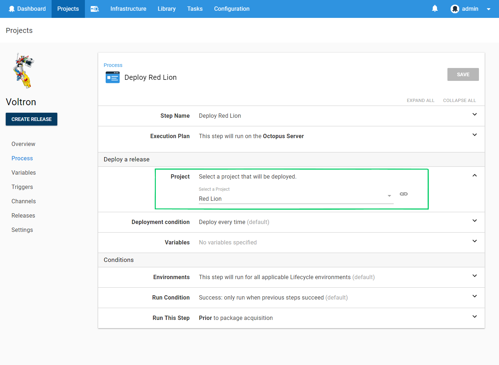

The _Deploy a Release_ step lets you have a project trigger the deployment of a release of another project. This is useful when you are [coordinating multiple projects](/docs/projects/coordinating-multiple-projects/).


when you add a _Deploy a Release_ step to your deployment process, you can then select the project which will be deployed.



You can add many _Deploy a Release_ steps to your process, if you wish to deploy releases of many projects.

## Creating a release

When creating a release of a project containing _Deploy a Release_ steps you can select the release version of each project, similar to the way versions of packages are selected:


:::hint
By default, Octopus will select the *latest* release based on the creation time of the release, and **not** the Semantic version. This means Octopus might initially select a release that has a lower version that the latest for a Project.
:::

### Channels

The [Channel](/docs/releases/channels/) used for any _Deploy a Release_ step is automatically determined by the release version of the project you select in the create release screen, since a channel is chosen when a release is created.

:::hint
It's possible to choose child releases from specific channels when using the _Deploy a Release_ step using [package version rules](/docs/releases/channels/#Channels-versionrules). Watch our - [Ask Octopus Episode: Deployment Channels with Child Projects](https://www.youtube.com/watch?v=3oLVq1EpUfc) to see it in action.
:::

## Conditional deployment

A _Deploy a Release_ step can be configured to:

- Deploy Always (default).
- Deploy if the selected release is not the current release in the environment.
- Deploy if the selected release has a higher version than the current release in the environment.

## Variables

Variables can be passed to the deployment triggered by the _Deploy a Release_ step. These will be made available to steps within the child deployment's process, just like regular [project variables](/docs/projects/variables/).  Variables passed in will override existing variables in the child project if the names collide.


### Output variables

You may wish to capture information from a deployment triggered by a _Deploy a Release_ step, either to be used in the parent process or to be passed to another deployment via another _Deploy a Release_ step.

Any [output variables](/docs/projects/variables/output-variables/) generated by a deployment will be captured as output variables on the _Deploy a Release_ step which triggered the deployment.  These can then be used by subsequent steps in the process.

These output variables are captured as variables with the following name pattern:

```
Octopus.Action[Deploy Release Step Name].Output.Deployment[Child Step Name].VariableName
```

and for [machine-specific output variables](/docs/projects/variables/output-variables.md#Outputvariables-Outputfrommultiplemachines):

```
Octopus.Action[Deploy Release Step Name].Output.Deployment[Child Step Name][Machine Name].VariableName
```

Where:

*Deploy Release Step Name:* The name of the _Deploy a Release_ step in the parent process.    
*Child Step Name:* The name of the step in the child deployment process which set the output variable.   
*VariableName:* The original name of the output variable. e.g. for `Set-OctopusVariable -Name "Foo" -Value "Bar"` this would be `Foo`.   
*Machine Name:* The machine the child process was targeting when the output variable was set.   

:::hint
For example, you have a project _Project Voltron_ which contains a _Deploy a Release_ step named _Deploy Red Lion_ which triggers a deployment of another project _Project Red Lion_.  
_Project Red Lion_ contains a step _Echo Paladin_ which sets an output variable. e.g.

```
Set-OctopusVariable -Name "Paladin" -Value "Lance"
```

This variable will be available in subsequent steps of the _Project Voltron_ process via the variable `Octopus.Action[Deploy Red Lion].Output.Deployment[Echo Paladin].Paladin`.
:::

## Lifecycles

The Lifecycles of projects being deployed by a _Deploy a Release_ step must be compatible with the coordinating project.

For example, if you have two projects, `Project A` and `Project B` which are referenced by _Deploy a Release_ steps in another project `Project Alphabet`. When deploying `Project Alphabet` to the `Test` environment, the release versions chosen for `Project A` and `Project B` must also be eligible to be deployed to the `Test` environment according to the lifecycles of those projects.

## Multi-tenant deployments

When a [tenanted](/docs/tenants/) project is being deployed by _Deploy a Release_ step, then the parent project should also be created as tenanted.

When triggering a tenanted deployment of the parent project, the tenant will be used to trigger the child deployment.

If the child project is untenanted, and the parent project is deployed with a tenant selected, then the untenanted child project will simply be deployed, ignoring the tenant.

### Deploying a combination of tenanted and untenanted projects

A project can contain multiple _Deploy a Release_ steps which deploy a combination of tenanted and untenanted projects. There are a number of approaches which can be used to control which _Deploy a Release_ steps will be executed.   

- Scope the _Deploy a Release_  step to one or more tenants.  This is useful if the child project should only be deployed for particular tenants.  
- If the child project is untenanted, and should only be deployed _once_ for all tenants, then the [Deployment Conditions](#conditional-deployment) can be used to specify that is should only be deployed if the version does not match.  This will prevent it from being deployed multiple times if multiple tenanted-deployments of the parent project are created.

## Rolling deployments

_Deploy a Release_ steps may be added as child steps, to be used in a [rolling deployment](/docs/deployments/patterns/rolling-deployments/).

When executing a rolling deployment containing a _Deploy a Release_ step, child deployments will be created per deployment target, as each target is rolled over.  i.e. if the rolling step specifies a target role which matches 10 deployment targets, then 10 child deployments will be created. 

:::hint
When configuring a _Deploy a Release_ step as a child step in a rolling deployment, the [deployment condition](#conditional-deployment) should be set to `Deploy Always`.   
Otherwise, as the step rolls across multiple machines, it will see the current release as having already been deployed to the environment, and execution will be skipped.  
:::

## Canceling a deployment

Canceling the deployment of the parent project as it's executing the Deploy a Release step won't cancel the deployment of the child project. The child deployment will continue to completion.
