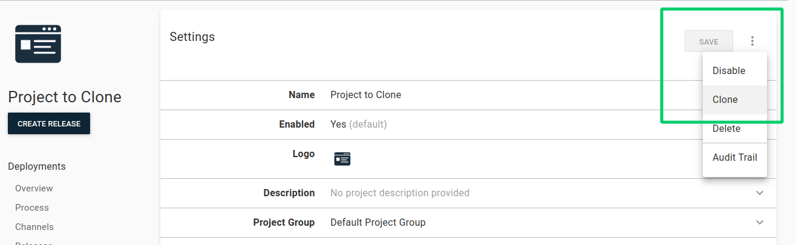

!include <projects>

If you have already created projects, or are joining an existing team, you'll see the existing projects on the projects page.

## Add a project

Before you can define your deployment processes or runbooks, you must create a project:

1. Select **Projects** from the main navigation, and click **ADD PROJECT**.
1. Give the project a name.
1. Click **SHOW ADVANCED**.
1. Add a description for the project.
1. If you want to change the [Project group](/docs/projects/#project-group) select an existing project group from the drop-down menu.
1. If you want to change the [Lifecycle](/docs/releases/lifecycles/) select an existing lifecycle from the drop down menu.
1. Click **SHOW LIFECYCLE** if you'd like to see a visual representation of the selected lifecycle.
1. Click **SAVE** and you will be taken to the newly created project's overview page.

Now that you've created a project, you can define your [deployment process](/docs/projects/deployment-process/) or [runbooks](/docs/runbooks/).

## Project settings

You can change the projects settings by accessing the settings menu on the project's main page. The settings you can change are:

- Name.
- Enable or disable the project to allow or prevent releases and deployments from being created.
- [Logo](#project-logo)
- Description
- [Project Group](#project-group)
- [Release Versioning](/docs/releases/release-versioning/)
- [Release Notes Template](/docs/releases/release-notes.md#Release-Notes-Templates)

### Deployment settings

- Package re-deployment
    - Specify to always deploy all packages or to skip any package steps that are already installed.
- Deployment targets
    - Specify if deployments are allowed if there are no deployment targets:
        - Deployments with no target are allowed - There must be at least one enabled healthy target to deploy to in the environment.
        - Allow deployments to be created when there are no deployment targets - Use this where no steps in the process have targets (or are all run on the Server), or you are dynamically adding targets during deployment.
- Deployment target status
    - Choose to skip unavailable, or exclude unhealthy targets from the deployment.
- [Deployment changes template](docs/releases/deployment-notes.md#Templates)
    - Specify a template for each deployment's changes.
- Default failure mode
    - Specify whether or not to use [guided failure mode](/docs/releases/guided-failures/).

## Project logo {#project-logo}

Customize your project logo to make it easily identifiable amongst other projects.

1. From the project's main page, select **Settings**.
2. Click the **Logo** section of the settings page.
3. Select from our built-in icon library paired with your choice of color or upload a custom image.
4. Click **Save**.

:::hint
For custom images, in addition to supporting .jpg and .png files, we also support .gif files. This means you can have an animated icon to add a little flair to your Octopus Deploy instance!
:::

## Project group {#project-group}

Project groups are a great way to organize your deployment projects. They have many uses; not only do they visually separate the projects, but you can also configure the dashboard to hide/show specific project groups and configure permissions to restrict access to them.

:::hint
The *Default Project* group contains all of the projects that have not been added to another group.
:::
## Add a project group

1. From the **Projects** tab, click **ADD GROUP**.
1. Give the group a name and description.
1. Click **SAVE**.

When the group is first created and doesn't have any projects associated with it, you will need to click **SHOW EMPTY GROUPS** on the projects page to see the group.

## Add projects to a group

After you have created a project group there are a number of ways you can add projects to the group:

- Navigate to the **Projects** page from the main navigation, find the group you want to add the project to, and click **ADD PROJECT**.
- Edit an existing project by navigating to the project, selecting **Settings** and editing the **Project Group**.
- Specify the **Project Group** under **Advanced Settings** when you create a new project.

### Edit or delete project groups

To edit or delete a project group click the project group’s overflow menu (...) and select **edit**. From there you can edit the groups name or description. If you need to delete the group, click the overflow menu again and select **Delete**.

## Project permissions

For information about project permissions, see [managing users and teams](/docs/security/users-and-teams/).

## Clone a project

Projects can be cloned.

1. From the project's menu, select **Settings**.
2. Click the overflow menu (...), and select **Clone**.

3. Give the new project you are cloning from the original project a name.
4. Review the settings for the new project and when you are satisfied, click **SAVE**.

After you've cloned a project, you can see details about where your project was cloned from and which projects have been cloned from your project, by navigating to the project's overview page and selecting **Settings** and looking at the **Cloning History** section.
