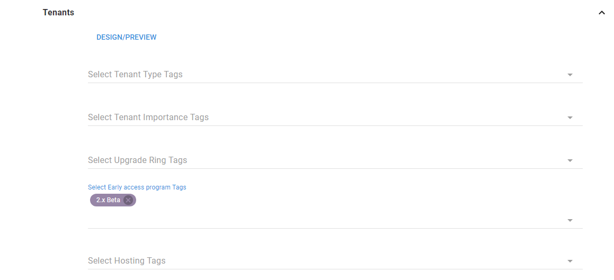
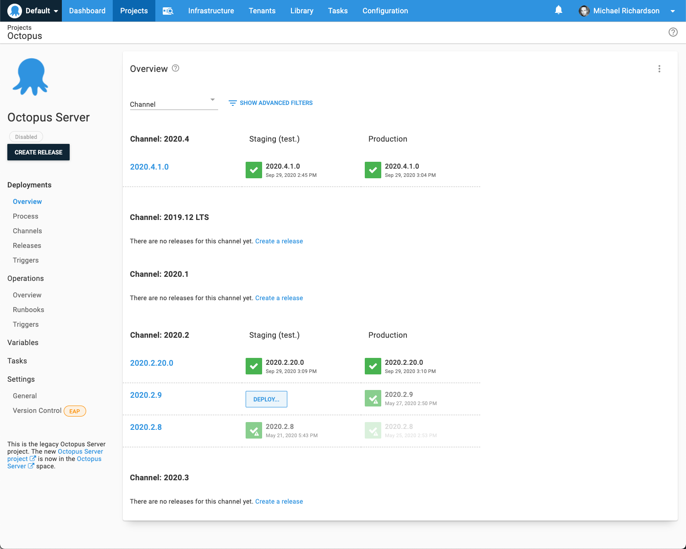

As you deploy your projects, you can assign [releases](/docs/releases/) of projects to specific channels. This is useful when you want releases of a project to be treated differently depending on the criteria you've set. Without channels, you could find yourself duplicating projects in order to implement multiple release strategies. This would, of course, leave you trying to manage multiple duplicated projects. Channels lets you use one project, with multiple release strategies.

Channels can be useful in the following scenarios:

- Feature branches (or experimental branches) are deployed to test environments but not production.
- Early access versions of the software are released to members of your early access program.
- Hot-fixes are deployed straight to production and then deployed through the rest of your infrastructure after the fix has been released.

When you are implementing a deployment process that uses channels you can scope the following to specific channels:

- [Lifecycles](#Channels-ControllingDeploymentLifecycle)
- [Steps](#Channels-ModifyingDeploymentProcess)
- [Variables](#Channels-Variables)
- [Tenants](#Channels-DeployingtoTenants)

You can also define versioning rules per channel to ensure that only versions which meet specific criteria are deployed to specific channels.

## Managing channels

Every [project](/docs/projects/) has a default channel.

Channels are managed from the Project overview page by selecting the specific project you are working with and clicking **Channels**.

As you add more channels, you'll notice that they are arranged in alphabetical order on the channels page.

## Create a new channel

1. From the Channels page, click on the **ADD CHANNEL** button.
2. Give the Channel a name and add a description. The channel name must be unique within the project.
3. Select the [Lifecycle](/docs/releases/lifecycles/) the channel will use, or allow the channel to inherit the default lifecycle for the project. See the [Lifecycle docs](/docs/releases/lifecycles/) for information about creating new lifecycles.
4. If you want to make this the default Channel for the project, click the **Default Channel** check-box.
5. Design the [version rules](#Channels-versionrules) that will be used to enforce which versions of your packages are deployed to this channel.

## Design the version rules {#Channels-versionrules}

Version rules assist in selecting the correct versions of packages for the Channel.  They are only used when creating a release, either manually or via [Automatic Release Creation](/docs/projects/project-triggers/automatic-release-creation/).

:::hint
Version Rules will work best when you follow [Semantic Versioning (SemVer 2.0.0)](http://semver.org) for your versioning strategy.
:::

1. From the **New Channel** screen, click **ADD VERSION RULE**.
2. Select the package step(s) (and as such the packages) the version rule will be applied to.
3. Enter the version range in the **Version Range** field. You can use either [Nuget](https://oc.to/NuGetVersioning) or [Maven](https://oc.to/MavenVersioning) versioning syntax to specify the range of versions to include.

You can use the full semantic version as part of your version range specification. For example: `[2.0.0-alpha.1,2.0.0)` will match all 2.0.0 pre-releases (where the pre-release component is `>= alpha.1`), and will exclude the 2.0.0 release.

4. Enter any pre-release tags you want to include.

Following the standard 2.0.0 [SemVer syntax](http://semver.org/), a pre-release tag is the alpha numeric text that can appear after the standard *major.minor.patch* pattern immediately following a hyphen. Providing a regex pattern for this field allows the channel to filter packages based on their tag in a very flexible manner.  The [SemVer build metadata](https://semver.org/#spec-item-10) will also be evaluated by the regex pattern. Some examples are.

| **Pattern** | **Description** | **Example use-case** |
| --- | --- | --- |
| \^[\^\\+].* | matches any pre-release | Enforce inability to push to production by specifying lifecycle that stops at staging |
| ^(\|\\+.*)$ | matches any non pre-release, but allows build metadata | Ensure a script step only runs for non pre-release packages |
| ^$ | matches versions with no pre-release or metadata components| Official releases are filtered to have nothing other than core version components (e.g. 1.0.0 )|
| ^beta | matches pre-releases like `beta` and `beta0003` | Deploy pre-releases using a Lifecycle that goes directly to a pre-release Environment |
| beta | matches pre-releases with beta anwhere in the tag like `beta` and `mybeta` | Deploy pre-releases using a Lifecycle that goes directly to a pre-release Environment |
| ^(?!beta).+ | matches pre-releases that don't start with beta | Consider anything other than 'beta' to be a feature branch package so you can provision short-term infrastructure and deploy to it |
| ^bugfix- | matches any with `*bugfix-*` prefix (e.g. `bugfix-syscrash`) | Bypass Dev & UAT environments when urgent bug fixes are made to the mainline branch and to be released straight from Staging to Production |
| ^beta | matches pre-releases which begin with `beta` but _not_ metadata containing `beta` | Prevent SemVer metadata from inadvertently matching the rule|

:::hint
If adding a pre-release tag to Channels, you will also need to add the tag `^$` to your `default` channel
:::

5. Click **DESIGN RULE**.

The **Design Version Rule** window will show a list of the packages that will deployed as part of the deploy package step selected earlier. The versions of the packages that will deployed in this channel with the version rules you've designed will be highlighted in green, and the versions of the packages that will not be deployed with be shown in red. You can continue to edit the version rules in this window.

6. Click **SAVE**.

## Using channels {#Channels-UsingChannels}

Once a project has more than one Channel, there a number of places they may be used.

### Controlling deployment lifecycle {#Channels-ControllingDeploymentLifecycle}

Each Channel defines which [Lifecycle](/docs/releases/lifecycles/) to use when promoting Releases between Environments. You can choose a Lifecycle for each Channel, or use the default Lifecycle defined by the Project.

For instance, when you ship pre-release software to your early access users, you can use an early access (or beta) channel which uses a Lifecycle that deploys the software to an environment your early access users have access to.

### Modifying deployment process {#Channels-ModifyingDeploymentProcess}

Deployment Steps can be restricted to only run on specific Channels.

For instance, you might decide you'd like to notify your early access users by email when an update version of the software is available. This can be achieved by adding an email step to your deployment process and scoping the step to the early access channel. That way the step will only run when a release is deployed to the early access channel and your early access users will only receive emails about relevant releases.

### Variables {#Channels-Variables}

As you release software to different Channels, it's likely that some of the variables in those Channels will need to be different. [Variables](/docs/projects/variables/) can be scoped to specific Channels.

### Deploying to tenants {#Channels-DeployingtoTenants}

You can control which Releases will be deployed to certain Tenants using Channels. In this example, Releases in this Channel will only be deployed to Tenants tagged with `Early access program/2.x Beta`.

## Creating releases {#Channels-CreatingReleases}

Every Release in Octopus Deploy must be placed into a Channel. Wherever possible Octopus will choose the best possible Channel for your Release, or you can manually select a Channel for your Release.

### Manually creating releases {#Channels-ManuallyCreatingReleases}

When you are creating a release, you can select a channel.

Selecting the channel will cause the release to use the lifecycle associated with the channel (or the project default, if the channel does not have a lifecycle).  It will also cause the deployment process and variables to be modified as specified above.

The package list allows you to select the version of each package involved in the deployment.  The *latest* column displays the latest packages that match the version rules defined for the channel (see [version rules](#Channels-versionrules) for more information).

### Using build server extensions or the Octopus CLI {#Channels-UsingBuildServerExtensionsOrTheOctopusCLI}

When using one of the [build server extensions](/docs/octopus-rest-api/) or the [Octopus CLI](/docs/octopus-rest-api/octopus-cli/create-release/) to create releases, you can either let Octopus automatically choose the correct Channel for your Release (this is the default behavior), or choose a specific Channel yourself.

### Automatic release creation {#Channels-AutomaticReleaseCreation}

When enabling [automatic release creation](/docs/projects/project-triggers/automatic-release-creation/) for your project, you are required to select a Channel (if the project has more than one).

Any releases created automatically will use the configured channel. Additionally, any version rules configured for the channel will be used to decide whether a release is automatically created.

For example, if version 3.1.0 of a package Acme.Web is pushed to the Octopus internal NuGet repository, and the channel selected for automatic release creation has a version rule range that doesn't include 3.1.0, then no release will be created.

## Discrete Channel Releases {#discrete-channel-releases}

The scenarios channels are used to model can be split into two categories.  In the first, the channel controls the way releases are deployed (different lifecycles, deployment steps, etc), but the deployed releases should not be treated differently. An example of this would be a _Hotfix_ channel, used to select a lifecycle designed to releases to production quickly.  

In the second mode of use, releases deployed via different channels are different, and should be treated as such. As an example of this, imagine a company that makes a deployment tool available as both a downloadable self-hosted product and a cloud-hosted software-as-a-service product.  In this example, the `self-hosted` and `cloud` channels not only select different lifecycles and deployment steps, but it is also desirable to view them as individual versions on the dashboard. 

In {{ Project, Settings }} there is an option named _Discrete Channel Releases_, designed to model this scenario.

Setting this to `Treat independently from other channels` will cause: 

- Versions for each channel to be displayed on the dashboard 
- Each channel to be treated independently when applying release [retention policies](/docs/administration/retention-policies/) 

The image below shows an example dashboard with discrete channel release enabled:

