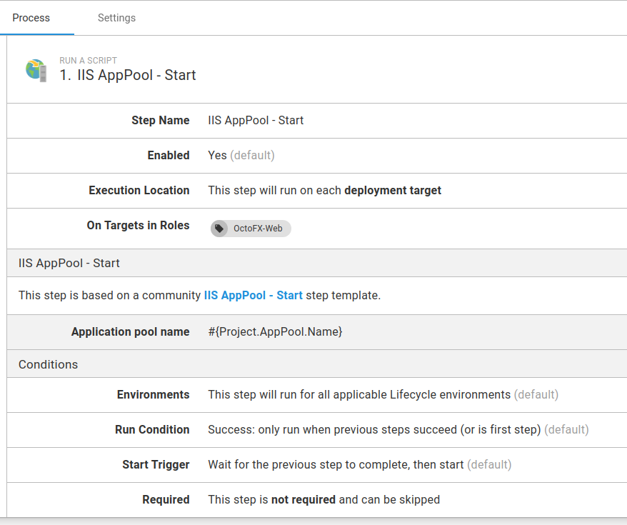
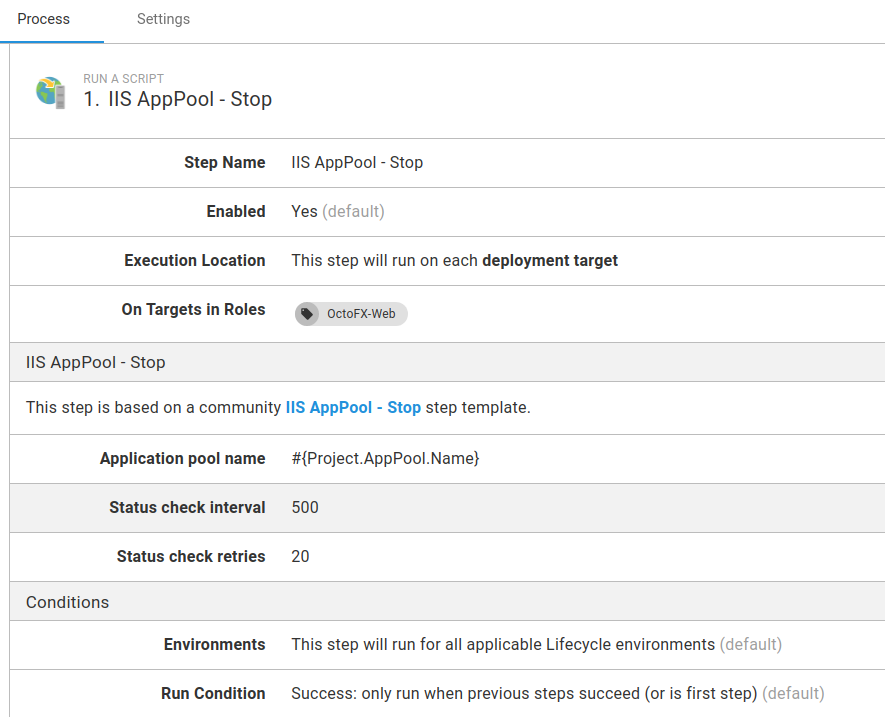
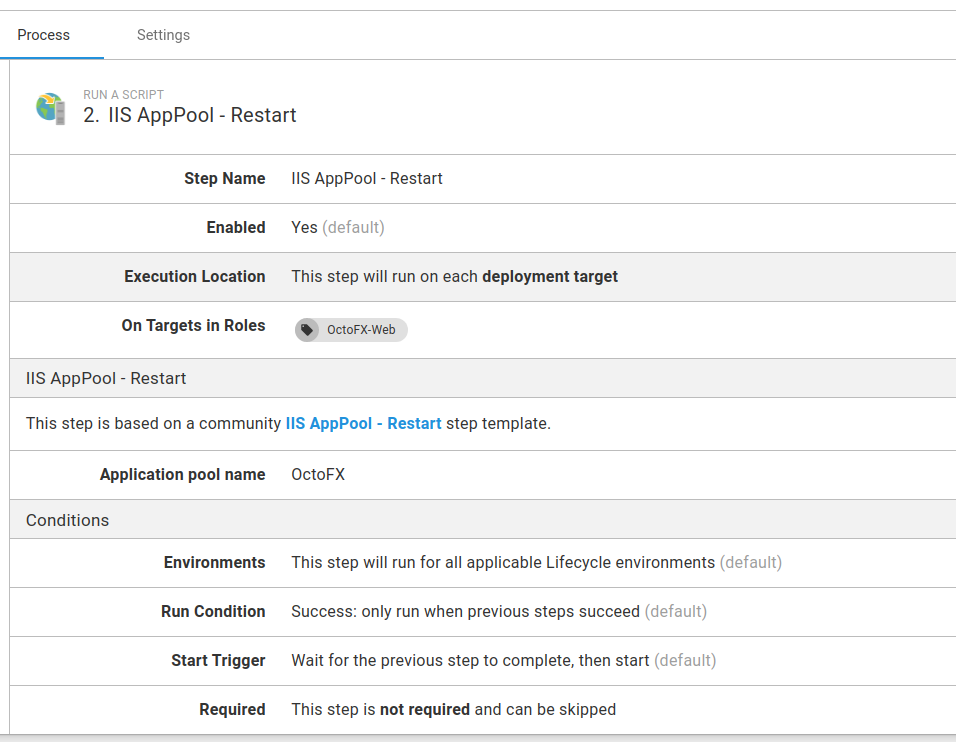
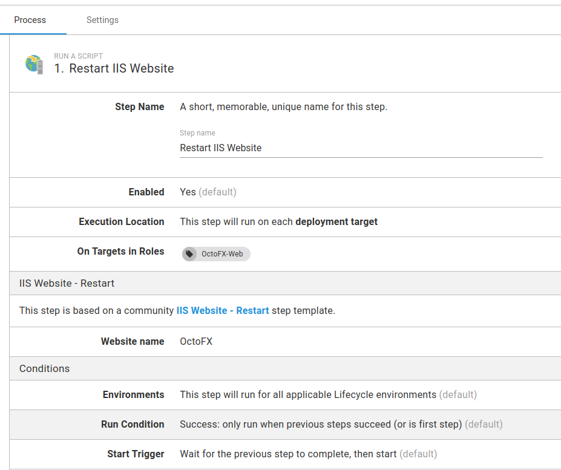
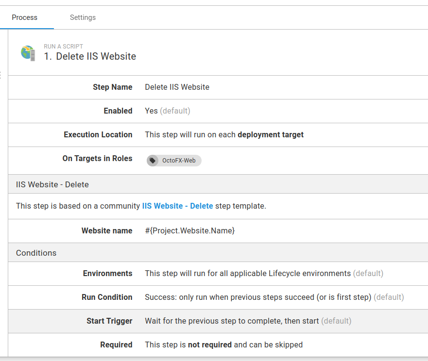

For many organizations, IIS remains an essential piece of software for running their web-applications. 

Managing IIS can often be challenging in an environment where you have a large estate of machines and need to carefully control who can access those machines.

You can create a runbook to execute as part of a routine operations task to manage your IIS websites without ever needing someone to log in.

This next section shows how you can create runbooks to complete the following tasks as part of your routine operations:

- [Install IIS runbook](#install-iis-runbook)
- [Install additional features](#install-additional-features)
- [Start application pool runbook](#start-app-pool)
- [Stop application pool runbook](#stop-app-pool)
- [Restart application pool runbook](#restart-app-pool)
- [Restart website runbook](#restart-website)
- [Delete website runbook](#delete-website)
- [Harden IIS](#harden-iis)

## Install IIS runbook {#install-iis-runbook}

To create a runbook to install IIS:

1. From your project's overview page, navigate to {{Operations, Runbooks}}, and click **ADD RUNBOOK**.
1. Give the runbook a Name and click **SAVE**.
1. Click **DEFINE YOUR RUNBOOK PROCESS**, and then click **ADD STEP**.
1. Click **Script**, and then select the **Run a Script** step.
1. Give the step a name.
1. Choose the **Execution Location** on which to run this step.
1. In the **Inline source code** section, add the following code as a **PowerShell** script:

```ps
if ((Get-WindowsFeature Web-Server).InstallState -eq "Installed") {
    Write-Host "IIS is installed"
} 
else {
    Write-Host "IIS is not installed and proceeding with Install"
    
    Enable-WindowsOptionalFeature -Online -FeatureName IIS-WebServerRole
    Enable-WindowsOptionalFeature -Online -FeatureName IIS-WebServer
}
```

The script checks to see if IIS is already installed by inspecting the `InstallState` for the `Web-Server` feature. If it’s installed it will skip the install of IIS.

:::hint
**Execution Policy:**
It’s possible you may need to set the [Execution policy](https://docs.microsoft.com/en-us/powershell/module/microsoft.powershell.security/set-executionpolicy) to an appropriate value (as part of the script) in order for it to run successfully. 
:::

### Additional IIS features {#install-additional-features}

There are over 25 additional IIS features you could choose to install as part of your runbook. To list all of the IIS Windows features, run the following PowerShell:

```ps
Get-WindowsOptionalFeature -Online | where FeatureName -like 'IIS-*'
```

The following code installs all of the additional features found from the previous `Get-WindowsOptionalFeature` command using the [Enable-WindowsOptionalFeature](https://docs.microsoft.com/en-us/powershell/module/dism/enable-windowsoptionalfeature?view=win10-ps) PowerShell cmdlet:

```ps
Enable-WindowsOptionalFeature -Online -FeatureName IIS-CommonHttpFeatures
Enable-WindowsOptionalFeature -Online -FeatureName IIS-HttpErrors
Enable-WindowsOptionalFeature -Online -FeatureName IIS-HttpRedirect
Enable-WindowsOptionalFeature -Online -FeatureName IIS-ApplicationDevelopment
Enable-WindowsOptionalFeature -online -FeatureName NetFx4Extended-ASPNET45
Enable-WindowsOptionalFeature -Online -FeatureName IIS-NetFxExtensibility45
Enable-WindowsOptionalFeature -Online -FeatureName IIS-HealthAndDiagnostics
Enable-WindowsOptionalFeature -Online -FeatureName IIS-HttpLogging
Enable-WindowsOptionalFeature -Online -FeatureName IIS-LoggingLibraries
Enable-WindowsOptionalFeature -Online -FeatureName IIS-RequestMonitor
Enable-WindowsOptionalFeature -Online -FeatureName IIS-HttpTracing
Enable-WindowsOptionalFeature -Online -FeatureName IIS-Security
Enable-WindowsOptionalFeature -Online -FeatureName IIS-RequestFiltering
Enable-WindowsOptionalFeature -Online -FeatureName IIS-Performance
Enable-WindowsOptionalFeature -Online -FeatureName IIS-WebServerManagementTools
Enable-WindowsOptionalFeature -Online -FeatureName IIS-IIS6ManagementCompatibility
Enable-WindowsOptionalFeature -Online -FeatureName IIS-Metabase
Enable-WindowsOptionalFeature -Online -FeatureName IIS-ManagementConsole
Enable-WindowsOptionalFeature -Online -FeatureName IIS-BasicAuthentication
Enable-WindowsOptionalFeature -Online -FeatureName IIS-WindowsAuthentication
Enable-WindowsOptionalFeature -Online -FeatureName IIS-StaticContent
Enable-WindowsOptionalFeature -Online -FeatureName IIS-DefaultDocument
Enable-WindowsOptionalFeature -Online -FeatureName IIS-WebSockets
Enable-WindowsOptionalFeature -Online -FeatureName IIS-ApplicationInit
Enable-WindowsOptionalFeature -Online -FeatureName IIS-ISAPIExtensions
Enable-WindowsOptionalFeature -Online -FeatureName IIS-ISAPIFilter
Enable-WindowsOptionalFeature -Online -FeatureName IIS-HttpCompressionStatic
Enable-WindowsOptionalFeature -Online -FeatureName IIS-ASPNET45
```

## Start application pool runbook {#start-app-pool}

To create a runbook to start your IIS application pool:

1. From your project's overview page, navigate to **{{Operations, Runbooks}}**, and click **ADD RUNBOOK**.
1. Give the runbook a name and click **SAVE**.
1. Add the community step template called [IIS AppPool - Start](https://library.octopus.com/step-templates/9db77671-0fe3-4aef-a014-551bf1e5e7ab/actiontemplate-iis-apppool-start), and give the step a name.
1. Choose the **Execution Location** on which to run this step.
1. Fill out the only required parameter: **Application Pool name**. 

:::hint
We recommend using [variables](/docs/projects/variables/) where appropriate, rather than entering values directly in the step parameters.
:::

Optionally, configure any [conditions](/docs/projects/steps/conditions/) for the step, click **Save**, and you have a runbook step to start an IIS Application Pool.



## Stop application pool runbook {#stop-app-pool}

To create a runbook to stop your application pool:

1. From your project's overview page, navigate to **{{Operations, Runbooks}}**, and click **ADD RUNBOOK**.
1. Give the runbook a Name and click **SAVE**.
1. Add the community step template called [IIS AppPool - Stop](https://library.octopus.com/step-templates/3aaf34a5-90eb-4ea1-95db-15ec93c1e54d/actiontemplate-iis-apppool-stop), and give the step a name.
1. Choose the **Execution Location** on which to run this step.
1. Fill out all of the required parameters in the step, using [variables](/docs/projects/variables/) where appropriate:

| Parameter  | Description | Example |
| ------------- | ------------- | ------------- |
| Application Pool Name | The name of the application pool in IIS. | AppPool-01 |
| Status check interval | The delay in milliseconds, between each attempt to query the application pool to see if has stopped. | 500 |
| Status check retries | The number of retries before an error is thrown. | 10 |

Configure any other settings for the step and click **Save**, and you have a runbook step to stop an IIS Application Pool.



## Restart application pool runbook {#restart-app-pool}

To create a runbook to restart your IIS application pool:

1. From your project's overview page, navigate to **{{Operations, Runbooks}}**, and click **ADD RUNBOOK**.
1. Give the runbook a name and click **SAVE**.
1. Add the community step template called [IIS AppPool - Restart](https://library.octopus.com/step-templates/de4a85ca-38cc-4a30-8244-64612e3a7921/actiontemplate-iis-apppool-restart), and give the step a name.
1. Choose the **Execution Location** on which to run this step.
1. Fill out the only required parameter: **Application pool name**, using a [variable](/docs/projects/variables/) if appropriate.

Configure any other settings for the step and click **Save**, and you have a runbook step to restart an IIS Application Pool.



## Restart website runbook {#restart-website}

To create a runbook to restart your IIS websites:

1. From your project's overview page, navigate to **{{Operations, Runbooks}}**, and click **ADD RUNBOOK**.
1. Give the runbook a name and click **SAVE**.
1. Add the community step template called [IIS Website - Restart](https://library.octopus.com/step-templates/6a17bd83-ef96-4c22-b212-91a89ca92fe6/actiontemplate-iis-website-restart), and give the step a name.
1. Choose the **Execution Location** on which to run this step.
1. Fill out the only required parameter: **Website name**, using a [variable](/docs/projects/variables/) if appropriate.

Configure any other settings for the step and click **Save**, and you have a runbook step to restart an IIS website.



## Delete website runbook {#delete-website}

To create a runbook to delete your IIS websites:

1. From your project's overview page, navigate to **{{Operations, Runbooks}}**, and click **ADD RUNBOOK**.
1. Give the runbook a name and click **SAVE**.
1. Add the community step template called [IIS Website - Delete](https://library.octopus.com/step-templates/a032159b-0742-4982-95f4-59877a31fba3/actiontemplate-iis-website-delete), and give the step a name.
1. Choose the **Execution Location** on which to run this step.
1. Fill out the only required parameter: **Website name**, using a [variable](/docs/projects/variables/) if appropriate.

Configure any other settings for the step and click **Save**, and you have a runbook step to delete an IIS website.



## Optional Approvals

You can also include additional steps to your runbook to include another layer of protection, such as a [manual intervention](/docs/projects/built-in-step-templates/manual-intervention-and-approvals/) step for business approvals. 

## Harden IIS

Your publicly available servers need to be as secure as you can make them.  Hackers are constantly finding new exploits so maintaining your security posture is a must.  With Octopus Deploy runbooks, you can define a single process that can harden your IIS installations according to [NIST guidelines](https://nvd.nist.gov/ncp/checklist/759) at the click of a button.

!include <security-disclaimer>

### Create the runbook

To create a runbook to harden your IIS server:

1. From your project's overview page, navigate to **{{Operations, Runbooks}}**, and click **ADD RUNBOOK**.
1. Give the runbook a Name and click **SAVE**.
1. Add a **Run a Script** step and past in the following example PowerShell:
:::warning
The following script makes a number of registry changes and alterations to ciphers, key hashes, key exchange algorithms, and cipher suite ordering.  Be sure to review the changes that it will implement before proceeding.
:::

```powershell
function Set-IISSecurity {

	$appcmd = $($env:windir + "\system32\inetsrv\appcmd.exe")

	#remove IIS server information
	#http://stackoverflow.com/questions/1178831/remove-server-response-header-iis7/12615970#12615970

	Write-Output 'Removing IIS and ASP.NET Server identification...'
	Write-Output '--------------------------------------------------------------------------------'
	& $appcmd set config  -section:system.webServer/rewrite/outboundRules /+"[name='Remove_RESPONSE_Server']" /commit:apphost
	& $appcmd set config  -section:system.webServer/rewrite/outboundRules "/[name='Remove_RESPONSE_Server'].patternSyntax:`"Wildcard`""  /commit:apphost
	& $appcmd set config  -section:system.webServer/rewrite/outboundRules "/[name='Remove_RESPONSE_Server'].match.serverVariable:RESPONSE_Server" "/[name='Remove_RESPONSE_Server'].match.pattern:`"*`"" /commit:apphost
	& $appcmd set config  -section:system.webServer/rewrite/outboundRules "/[name='Remove_RESPONSE_Server'].action.type:`"Rewrite`"" "/[name='Remove_RESPONSE_Server'].action.value:`" `""  /commit:apphost

	& $appcmd set config /section:httpProtocol "/-customHeaders.[name='X-Powered-By']"

	#Enable HTTPS only redirect and add HSTS header
	#https://www.owasp.org/index.php/HTTP_Strict_Transport_Security#IIS

	#Set HTTPS Only redirect
	Write-Output 'Setting HTTPS Only'
	Write-Output '--------------------------------------------------------------------------------'
	& $appcmd set config  -section:system.webServer/rewrite/rules /+"[name='HTTPS_301_Redirect',stopProcessing='False']" /commit:apphost
	& $appcmd set config  -section:system.webServer/rewrite/rules "/[name='HTTPS_301_Redirect',stopProcessing='False'].match.url:`"(.*)`""  /commit:apphost
	& $appcmd set config  -section:system.webServer/rewrite/rules "/+[name='HTTPS_301_Redirect',stopProcessing='False'].conditions.[input='{HTTPS}',pattern='off']" /commit:apphost
	& $appcmd set config  -section:system.webServer/rewrite/rules "/[name='HTTPS_301_Redirect',stopProcessing='False'].action.type:`"Redirect`"" "/[name='HTTPS_301_Redirect',stopProcessing='False'].action.url:`"https://{HTTP_HOST}{REQUEST_URI}`""  /commit:apphost


	#HSTS header
	Write-Output 'Configuring HSTS header...'
	Write-Output '--------------------------------------------------------------------------------'
	#precondition for HSTS header
	& $appcmd set config  -section:system.webServer/rewrite/outboundRules /+"preConditions.[name='USING_HTTPS']" /commit:apphost
	& $appcmd set config  -section:system.webServer/rewrite/outboundRules /"+preConditions.[name='USING_HTTPS'].[input='{HTTPS}',pattern='on']" /commit:apphost

	#set header
	& $appcmd set config  -section:system.webServer/rewrite/outboundRules /+"[name='Add_HSTS_Header',preCondition='USING_HTTPS']" /commit:apphost
	& $appcmd set config  -section:system.webServer/rewrite/outboundRules "/[name='Add_HSTS_Header'].patternSyntax:`"Wildcard`""  /commit:apphost
	& $appcmd set config  -section:system.webServer/rewrite/outboundRules "/[name='Add_HSTS_Header',preCondition='USING_HTTPS'].match.serverVariable:`"RESPONSE_Strict-Transport-Security`"" "/[name='Add_HSTS_Header',preCondition='USING_HTTPS'].match.pattern:`"*`"" /commit:apphost
	& $appcmd set config  -section:system.webServer/rewrite/outboundRules "/[name='Add_HSTS_Header',preCondition='USING_HTTPS'].action.type:`"Rewrite`"" "/[name='Add_HSTS_Header',preCondition='USING_HTTPS'].action.value:`"max-age=31536000`""  /commit:apphost

	#prevent framejacking
	#https://support.microsoft.com/en-us/kb/2694329
	& $appcmd set config -section:httpProtocol "/+customHeaders.[name='X-Frame-Options',value='SAMEORIGIN']"

	#Improve SSL ciphers, add PFS, disable SSLv3
	#https://www.hass.de/content/setup-your-iis-ssl-perfect-forward-secrecy-and-tls-12
	 
	Write-Output 'Configuring IIS with SSL/TLS Deployment Best Practices...'
	Write-Output '--------------------------------------------------------------------------------'
	 
	# Disable Multi-Protocol Unified Hello
	New-Item 'HKLM:\SYSTEM\CurrentControlSet\Control\SecurityProviders\SCHANNEL\Protocols\Multi-Protocol Unified Hello\Server' -Force | Out-Null
	New-ItemProperty -path 'HKLM:\SYSTEM\CurrentControlSet\Control\SecurityProviders\SCHANNEL\Protocols\Multi-Protocol Unified Hello\Server' -name Enabled -value 0 -PropertyType 'DWord' -Force | Out-Null
	New-ItemProperty -path 'HKLM:\SYSTEM\CurrentControlSet\Control\SecurityProviders\SCHANNEL\Protocols\Multi-Protocol Unified Hello\Server' -name 'DisabledByDefault' -value 1 -PropertyType 'DWord' -Force | Out-Null
	Write-Output 'Multi-Protocol Unified Hello has been disabled.'
	 
	# Disable PCT 1.0
	New-Item 'HKLM:\SYSTEM\CurrentControlSet\Control\SecurityProviders\SCHANNEL\Protocols\PCT 1.0\Server' -Force | Out-Null
	New-ItemProperty -path 'HKLM:\SYSTEM\CurrentControlSet\Control\SecurityProviders\SCHANNEL\Protocols\PCT 1.0\Server' -name Enabled -value 0 -PropertyType 'DWord' -Force | Out-Null
	New-ItemProperty -path 'HKLM:\SYSTEM\CurrentControlSet\Control\SecurityProviders\SCHANNEL\Protocols\PCT 1.0\Server' -name 'DisabledByDefault' -value 1 -PropertyType 'DWord' -Force | Out-Null
	Write-Output 'PCT 1.0 has been disabled.'
	 
	# Disable SSL 2.0 (PCI Compliance)
	New-Item 'HKLM:\SYSTEM\CurrentControlSet\Control\SecurityProviders\SCHANNEL\Protocols\SSL 2.0\Server' -Force | Out-Null
	New-ItemProperty -path 'HKLM:\SYSTEM\CurrentControlSet\Control\SecurityProviders\SCHANNEL\Protocols\SSL 2.0\Server' -name Enabled -value 0 -PropertyType 'DWord' -Force | Out-Null
	New-ItemProperty -path 'HKLM:\SYSTEM\CurrentControlSet\Control\SecurityProviders\SCHANNEL\Protocols\SSL 2.0\Server' -name 'DisabledByDefault' -value 1 -PropertyType 'DWord' -Force | Out-Null
	Write-Output 'SSL 2.0 has been disabled.'
	 
	# NOTE: If you disable SSL 3.0 the you may lock out some people still using
	# Windows XP with IE6/7. Without SSL 3.0 enabled, there is no protocol available
	# for these people to fall back. Safer shopping certifications may require that
	# you disable SSLv3.
	#
	# Disable SSL 3.0 (PCI Compliance) and enable "Poodle" protection
	New-Item 'HKLM:\SYSTEM\CurrentControlSet\Control\SecurityProviders\SCHANNEL\Protocols\SSL 3.0\Server' -Force | Out-Null
	New-ItemProperty -path 'HKLM:\SYSTEM\CurrentControlSet\Control\SecurityProviders\SCHANNEL\Protocols\SSL 3.0\Server' -name Enabled -value 0 -PropertyType 'DWord' -Force | Out-Null
	New-ItemProperty -path 'HKLM:\SYSTEM\CurrentControlSet\Control\SecurityProviders\SCHANNEL\Protocols\SSL 3.0\Server' -name 'DisabledByDefault' -value 1 -PropertyType 'DWord' -Force | Out-Null
	Write-Output 'SSL 3.0 has been disabled.'
	 
	# Add and Enable TLS 1.0 for client and server SCHANNEL communications
	New-Item 'HKLM:\SYSTEM\CurrentControlSet\Control\SecurityProviders\SCHANNEL\Protocols\TLS 1.0\Server' -Force | Out-Null
	New-ItemProperty -path 'HKLM:\SYSTEM\CurrentControlSet\Control\SecurityProviders\SCHANNEL\Protocols\TLS 1.0\Server' -name 'Enabled' -value 1 -PropertyType 'DWord' -Force | Out-Null
	New-ItemProperty -path 'HKLM:\SYSTEM\CurrentControlSet\Control\SecurityProviders\SCHANNEL\Protocols\TLS 1.0\Server' -name 'DisabledByDefault' -value 0 -PropertyType 'DWord' -Force | Out-Null
	Write-Output 'TLS 1.0 has been enabled.'
	 
	# Add and Enable TLS 1.1 for client and server SCHANNEL communications
	New-Item 'HKLM:\SYSTEM\CurrentControlSet\Control\SecurityProviders\SCHANNEL\Protocols\TLS 1.1\Server' -Force | Out-Null
	New-Item 'HKLM:\SYSTEM\CurrentControlSet\Control\SecurityProviders\SCHANNEL\Protocols\TLS 1.1\Client' -Force | Out-Null
	New-ItemProperty -path 'HKLM:\SYSTEM\CurrentControlSet\Control\SecurityProviders\SCHANNEL\Protocols\TLS 1.1\Server' -name 'Enabled' -value 1 -PropertyType 'DWord' -Force | Out-Null
	New-ItemProperty -path 'HKLM:\SYSTEM\CurrentControlSet\Control\SecurityProviders\SCHANNEL\Protocols\TLS 1.1\Server' -name 'DisabledByDefault' -value 0 -PropertyType 'DWord' -Force | Out-Null
	New-ItemProperty -path 'HKLM:\SYSTEM\CurrentControlSet\Control\SecurityProviders\SCHANNEL\Protocols\TLS 1.1\Client' -name 'Enabled' -value 1 -PropertyType 'DWord' -Force | Out-Null
	New-ItemProperty -path 'HKLM:\SYSTEM\CurrentControlSet\Control\SecurityProviders\SCHANNEL\Protocols\TLS 1.1\Client' -name 'DisabledByDefault' -value 0 -PropertyType 'DWord' -Force | Out-Null
	Write-Output 'TLS 1.1 has been enabled.'
	 
	# Add and Enable TLS 1.2 for client and server SCHANNEL communications
	New-Item 'HKLM:\SYSTEM\CurrentControlSet\Control\SecurityProviders\SCHANNEL\Protocols\TLS 1.2\Server' -Force | Out-Null
	New-Item 'HKLM:\SYSTEM\CurrentControlSet\Control\SecurityProviders\SCHANNEL\Protocols\TLS 1.2\Client' -Force | Out-Null
	New-ItemProperty -path 'HKLM:\SYSTEM\CurrentControlSet\Control\SecurityProviders\SCHANNEL\Protocols\TLS 1.2\Server' -name 'Enabled' -value 1 -PropertyType 'DWord' -Force | Out-Null
	New-ItemProperty -path 'HKLM:\SYSTEM\CurrentControlSet\Control\SecurityProviders\SCHANNEL\Protocols\TLS 1.2\Server' -name 'DisabledByDefault' -value 0 -PropertyType 'DWord' -Force | Out-Null
	New-ItemProperty -path 'HKLM:\SYSTEM\CurrentControlSet\Control\SecurityProviders\SCHANNEL\Protocols\TLS 1.2\Client' -name 'Enabled' -value 1 -PropertyType 'DWord' -Force | Out-Null
	New-ItemProperty -path 'HKLM:\SYSTEM\CurrentControlSet\Control\SecurityProviders\SCHANNEL\Protocols\TLS 1.2\Client' -name 'DisabledByDefault' -value 0 -PropertyType 'DWord' -Force | Out-Null
	Write-Output 'TLS 1.2 has been enabled.'
	 
	# Re-create the ciphers key.
	New-Item 'HKLM:SYSTEM\CurrentControlSet\Control\SecurityProviders\SCHANNEL\Ciphers' -Force | Out-Null
	 
	# Disable insecure/weak ciphers.
	$insecureCiphers = @(
	  'DES 56/56',
	  'NULL',
	  'RC2 128/128',
	  'RC2 40/128',
	  'RC2 56/128',
	  'RC4 40/128',
	  'RC4 56/128',
	  'RC4 64/128',
	  'RC4 128/128'
	)
	Foreach ($insecureCipher in $insecureCiphers) {
	  $key = (Get-Item HKLM:\).OpenSubKey('SYSTEM\CurrentControlSet\Control\SecurityProviders\SCHANNEL\Ciphers', $true).CreateSubKey($insecureCipher)
	  $key.SetValue('Enabled', 0, 'DWord')
	  $key.close()
	  Write-Output "Weak cipher $insecureCipher has been disabled."
	}
	 
	# Enable new secure ciphers.
	# - RC4: It is recommended to disable RC4, but you may lock out WinXP/IE8 if you enforce this. This is a requirement for FIPS 140-2.
	$secureCiphers = @(
	  'AES 128/128',
	  'AES 256/256'
	)
	Foreach ($secureCipher in $secureCiphers) {
	  $key = (Get-Item HKLM:\).OpenSubKey('SYSTEM\CurrentControlSet\Control\SecurityProviders\SCHANNEL\Ciphers', $true).CreateSubKey($secureCipher)
	  New-ItemProperty -path "HKLM:\SYSTEM\CurrentControlSet\Control\SecurityProviders\SCHANNEL\Ciphers\$secureCipher" -name 'Enabled' -value '0xffffffff' -PropertyType 'DWord' -Force | Out-Null
	  $key.close()
	  Write-Output "Strong cipher $secureCipher has been enabled."
	}
	 
	# Set hashes configuration.
	New-Item 'HKLM:\SYSTEM\CurrentControlSet\Control\SecurityProviders\SCHANNEL\Hashes\MD5' -Force | Out-Null
	New-ItemProperty -path 'HKLM:\SYSTEM\CurrentControlSet\Control\SecurityProviders\SCHANNEL\Hashes\MD5' -name Enabled -value 0 -PropertyType 'DWord' -Force | Out-Null
	 
	New-Item 'HKLM:\SYSTEM\CurrentControlSet\Control\SecurityProviders\SCHANNEL\Hashes\SHA' -Force | Out-Null
	New-ItemProperty -path 'HKLM:\SYSTEM\CurrentControlSet\Control\SecurityProviders\SCHANNEL\Hashes\SHA' -name Enabled -value '0xffffffff' -PropertyType 'DWord' -Force | Out-Null
	 
	# Set KeyExchangeAlgorithms configuration.
	New-Item 'HKLM:\SYSTEM\CurrentControlSet\Control\SecurityProviders\SCHANNEL\KeyExchangeAlgorithms\Diffie-Hellman' -Force | Out-Null
	New-ItemProperty -path 'HKLM:\SYSTEM\CurrentControlSet\Control\SecurityProviders\SCHANNEL\KeyExchangeAlgorithms\Diffie-Hellman' -name Enabled -value '0xffffffff' -PropertyType 'DWord' -Force | Out-Null
	 
	New-Item 'HKLM:\SYSTEM\CurrentControlSet\Control\SecurityProviders\SCHANNEL\KeyExchangeAlgorithms\PKCS' -Force | Out-Null
	New-ItemProperty -path 'HKLM:\SYSTEM\CurrentControlSet\Control\SecurityProviders\SCHANNEL\KeyExchangeAlgorithms\PKCS' -name Enabled -value '0xffffffff' -PropertyType 'DWord' -Force | Out-Null
	 
	# Set cipher suites order as secure as possible (Enables Perfect Forward Secrecy).
	$cipherSuitesOrder = @(
	  'TLS_ECDHE_RSA_WITH_AES_256_CBC_SHA384_P521',
	  'TLS_ECDHE_RSA_WITH_AES_256_CBC_SHA384_P384',
	  'TLS_ECDHE_RSA_WITH_AES_256_CBC_SHA384_P256',
	  'TLS_ECDHE_RSA_WITH_AES_256_CBC_SHA_P521',
	  'TLS_ECDHE_RSA_WITH_AES_256_CBC_SHA_P384',
	  'TLS_ECDHE_RSA_WITH_AES_256_CBC_SHA_P256',
	  'TLS_ECDHE_RSA_WITH_AES_128_CBC_SHA256_P521',
	  'TLS_ECDHE_RSA_WITH_AES_128_CBC_SHA_P521',
	  'TLS_ECDHE_RSA_WITH_AES_128_CBC_SHA256_P384',
	  'TLS_ECDHE_RSA_WITH_AES_128_CBC_SHA256_P256',
	  'TLS_ECDHE_RSA_WITH_AES_128_CBC_SHA_P384',
	  'TLS_ECDHE_RSA_WITH_AES_128_CBC_SHA_P256',
	  'TLS_ECDHE_ECDSA_WITH_AES_256_GCM_SHA384_P521',
	  'TLS_ECDHE_ECDSA_WITH_AES_256_GCM_SHA384_P384',
	  'TLS_ECDHE_ECDSA_WITH_AES_128_GCM_SHA256_P521',
	  'TLS_ECDHE_ECDSA_WITH_AES_128_GCM_SHA256_P384',
	  'TLS_ECDHE_ECDSA_WITH_AES_128_GCM_SHA256_P256',
	  'TLS_ECDHE_ECDSA_WITH_AES_256_CBC_SHA384_P521',
	  'TLS_ECDHE_ECDSA_WITH_AES_256_CBC_SHA384_P384',
	  'TLS_ECDHE_ECDSA_WITH_AES_256_CBC_SHA_P521',
	  'TLS_ECDHE_ECDSA_WITH_AES_256_CBC_SHA_P384',
	  'TLS_ECDHE_ECDSA_WITH_AES_256_CBC_SHA_P256',
	  'TLS_ECDHE_ECDSA_WITH_AES_128_CBC_SHA256_P521',
	  'TLS_ECDHE_ECDSA_WITH_AES_128_CBC_SHA256_P384',
	  'TLS_ECDHE_ECDSA_WITH_AES_128_CBC_SHA256_P256',
	  'TLS_ECDHE_ECDSA_WITH_AES_128_CBC_SHA_P521',
	  'TLS_ECDHE_ECDSA_WITH_AES_128_CBC_SHA_P384',
	  'TLS_ECDHE_ECDSA_WITH_AES_128_CBC_SHA_P256',
	  'TLS_DHE_DSS_WITH_AES_256_CBC_SHA256',
	  'TLS_DHE_DSS_WITH_AES_256_CBC_SHA',
	  'TLS_DHE_DSS_WITH_AES_128_CBC_SHA256',
	  'TLS_DHE_DSS_WITH_AES_128_CBC_SHA',
	  'TLS_RSA_WITH_AES_256_CBC_SHA256',
	  'TLS_RSA_WITH_AES_256_CBC_SHA',
	  'TLS_RSA_WITH_AES_128_CBC_SHA256',
	  'TLS_RSA_WITH_AES_128_CBC_SHA'
	)
	$cipherSuitesAsString = [string]::join(',', $cipherSuitesOrder)
	New-ItemProperty -path 'HKLM:\SOFTWARE\Policies\Microsoft\Cryptography\Configuration\SSL\00010002' -name 'Functions' -value $cipherSuitesAsString -PropertyType 'String' -Force | Out-Null
	 
	Write-Output '--------------------------------------------------------------------------------'
	Write-Output 'NOTE: After the system has been rebooted you can verify your server'
	Write-Output '      configuration at https://www.ssllabs.com/ssltest/'
	Write-Output "--------------------------------------------------------------------------------`n"
	 
	Write-Host -ForegroundColor Red 'A computer restart is required to apply settings. Restart computer now?'
	Restart-Computer -Force -Confirm

}
```

After your IIS server has rebooted, your installation will be hardened against common attacks.

## Samples

We have a [Target - Windows](https://oc.to/TargetWindowsSamplesSpace) Space on our Samples instance of Octopus. You can sign in as `Guest` to take a look at this example and more runbooks in the `OctoFX` project.

## Learn more

- Generate an Octopus guide for [IIS and the rest of your CI/CD pipeline](https://octopus.com/docs/guides?destination=IIS).
- [PowerShell and IIS: 20 practical examples blog post](https://octopus.com/blog/iis-powershell).
