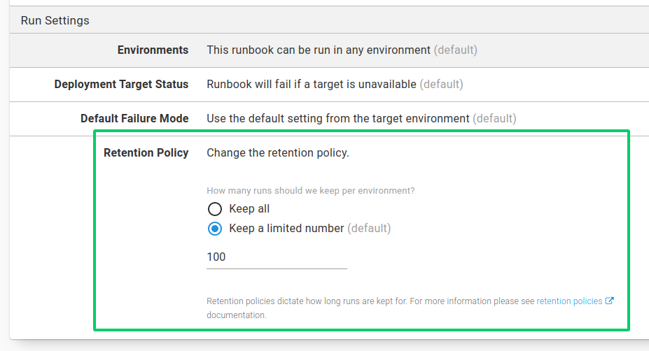

For users familiar with Octopus prior to the introduction of runbooks, an obvious question may be _how are runbooks different to a deployment process?_  They are similar in many ways: a runbook process is a series of steps, which can reference packages and variables. The key differences are:

- No release needs to be created to execute a runbook.
- Lifecycles do not apply to runbooks.
- Runbook executions are not displayed on the deployment dashboards.
- Many runbooks can live in the same project, along with a deployment process.
- Runbooks have different roles and permissions to deployments.

## Variables

A [project's variables](/docs/projects/variables/index.md) are shared between the deployment process and any runbooks in the project (though specific values can be scoped exclusively to specific runbooks or to the deployment process). This means the following configurations can be shared between your deployment process and runbooks:
- Database connection strings
- Passwords
- Certificates
- Accounts

### Current limitations

**Scoping to Steps/Actions**
- You cannot currently scope project variables to a deployment process step and a runbook process step, but we do aim to support this in the near future.

## Environments

In Octopus 2020.2 and earlier, runbooks could be executed against any environment for which the user had an appropriately scoped `RunbookRunCreate` permission.

From **Octopus 2020.3**, it’s also possible to choose which environments a runbook can be run in by selecting this from the *Run settings* in **{{Runbook,Settings}}**:

You can select the runbook to run in:
- All environments (the default).
- Only specific environments.
- Environments from the [Project Lifecycle](/docs/releases/lifecycles/index.md).

:::hint
In Octopus 2020.2 and earlier, if you need to restrict the environment that a runbook can be executed in, you can achieve this by adding an [Environment run condition](/docs/projects/steps/conditions/index.md#environments) in each step of the runbook process.
:::

## Retention policy

Project [Lifecycles](/docs/releases/lifecycles/index.md) and their retention policies do not apply to runbooks (only deployments). From **Octopus 2020.3**, it’s possible to set a retention policy for a runbook by selecting this from the *Run settings* in **{{Runbook,Settings}}**:

You can choose to:
- Keep **all** of the runbook runs.
- Keep a limited number of runbook runs (the default).

The retention policy is applied **per environment**. For example, if you had three environments, Development, Staging and Production and you set the retention policy limit to 10, that would keep a total of **30** runbook runs - 10 in *each* of Development, Staging and Production.

:::hint
In Octopus 2020.2 and earlier, the runbook retention policy could not be set. Instead, Octopus would keep the last 1000 runs.
:::

## Snapshots vs Releases

Runbooks are similar to deployments in that they also take a copy of the process to be used with execution. For a runbook this is referred to as a [snapshot](/docs/runbooks/runbook-publishing/index.md#snapshots) versus a [release](/docs/releases/index.md) for a deployment. Runbooks can have two different types of snapshots:
- Draft
- Published

:::hint
**Package versions are included in a snapshot**
Similar to releases, the version of any packages that are used in the runbook are also snapshotted. This means if a newer version of the package is uploaded, and you wish to use it in your runbook, you will need to create a new snapshot of the runbook.
:::