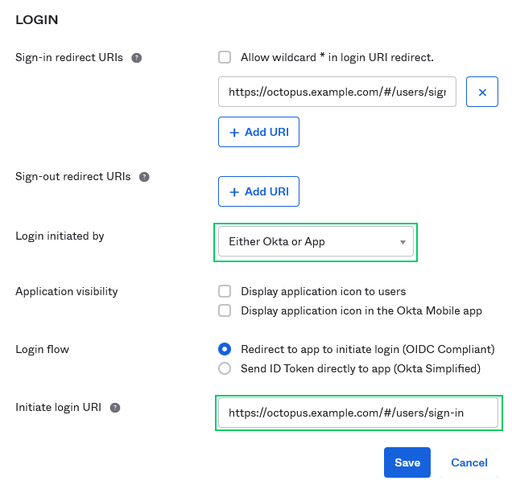
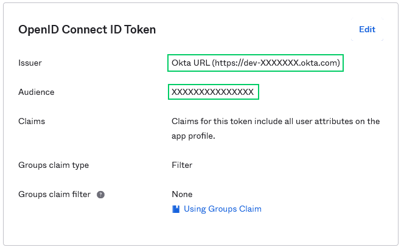

Authentication using [Okta](https://www.okta.com/), a cloud-based identity management service.

To use Okta authentication with Octopus you will need to:

1. Configure Okta to trust your Octopus Deploy instance (by setting it up as an app in Okta).
2. Configure your Octopus Deploy instance to trust and use Okta as an Identity Provider.

## Configure Okta {#Oktaauthentication-ConfiguringOkta}

The first steps are to configure Okta to trust your instance of Octopus Deploy by configuring an app in your Okta account.

### Configure an app {#Oktaauthentication-SetupanApp}

You must first have an account at [Okta](https://www.okta.com/). You can sign up for a free [developer account](https://developer.okta.com/signup/).

Once you have an account, log in to the Okta admin portal.

:::hint
After signing up to Okta you will receive your own url to access the Okta portal. For a developer account, it will look something similar to: `https://dev-xxxxxx-admin.okta.com`.
:::

1. Select the Applications tab and click the **Create App Integration** button.

   

2. Choose **Web** for the **OIDC - OpenID Connect** for the **Sign-in method** and **Web Application** for the **Application type** and click the **Next** button.

   

3. Enter an **App integration name** like Octopus Deploy and for the **Sign-in redirect URIs** enter `https://octopus.example.com/api/users/authenticatedToken/Okta` replacing `https://octopus.example.com` with the public URL of your Octopus Server, remove any default **Sign-out redirect URIs** and click the **Save** button.

   

:::hint
**Tips::**
- **Reply URLs are case-sensitive** - Please take care when adding this URL. They are **case-sensitive** and can be sensitive to trailing **slash** characters.
- **Not using SSL?** - We highly recommend using SSL, but we know its not always possible. You can use `http` if you do not have SSL enabled on your Octopus Server. Please beware of the security implications in accepting a security token over an insecure channel.
Octopus integrates with [Let's Encrypt](/docs/security/exposing-octopus/lets-encrypt-integration/) making it easier to setup SSL on your Octopus Server.
:::

   If you want to allow users to log in directly from Okta then change the **Login initiated by** to _Either Okta or App_, set **Login flow** to _Redirect to app to initiate login_, and set the **Initiate login URI** to `https://octopus.example.com/#/users/sign-in`.

   

:::warning
Support for OAuth code flow with PKCE was introduced in **Octopus 2022.2.4498**. If you are using a version older than this you will also need to select the **Implicit (hybrid)** grant type.
:::

### OpenID Connect settings {#Oktaauthentication-OpenIDConnectSettings}

There are two values you will need from the Okta configuration to complete the Octopus configuration: the **Client ID** and **Issuer**. (The Client ID is also referred to as Audience.)

Select the **Sign On** tab and scroll down to the **OpenID Connect ID Token** section. Take note of the **Issuer** and **Audience** as you will need both these values to configure your Octopus Server.



#### Okta group integration {#Oktaauthentication-OpenIDConnectSettings-OktaGroups}

If you want Okta groups to flow through to Octopus, you'll need to change the _Groups claim_ fields as follows:


Note that the Regex is ```.*```, the period is important!

#### Active Directory integration {#Oktaauthentication-OpenIDConnectSettings-ADGroups}

If you want to configure Okta to present your active directory groups, use a similar approach to [Okta group integration](#Oktaauthentication-OpenIDConnectSettings-OktaGroups), however we recommend that you use a _Groups claim type_ of **Expression** instead of **Filter**.

For example, if you have all of your Octopus groups prefixed with `Octopus.` (e.g. `Octopus.Admins`, `Octopus.Deployers`, etc.) then you could use the following expression to pass along the correct AD groups:

```
Groups.startsWith("active_directory", "Octopus.", 10)
```
This expression will search `active_directory` for any groups that start with the name `Octopus.` and only return the first 10 results.

> A complete guide to Okta's group expressions are available [here](https://developer.okta.com/docs/guides/customize-tokens-dynamic/main/#add-a-groups-claim-with-a-dynamic-allow-list)

### Assign app {#Oktaauthentication-AssignApp}

Next you will need to assign your app to people or groups within your Okta directory.

1. Select the **Assignments** tab and click the **Assign** button. You can assign your app to people, and to groups.

   

2. The app may be assigned to **Everyone** by default. If not, to assign the app to all users, you can simply assign the default **Everyone** group to the app, and click **Done**.

## Configure Octopus Server {#Oktaauthentication-ConfiguringOctopusDeployServer}

You will need the **Client ID** (aka **Audience**), **Client secret** and **Issuer** obtained from the Okta portal as described above.

:::hint
Support for OAuth code flow with PKCE was introduced in **Octopus 2022.2.4498**. If you are using a version older than this, the **Client secret** setting is not required.
:::

To configure Octopus to use Okta authentication you'll need:

- The **Client ID**, which should be a string value like `0a4bxxxxxxxxxxxx9yc3`.
- The **Client secret**, which should be a string value like `uJxxxxxxxxxxxxxxxxxxxxxxxxxxxxxxxxxxSS`.
- The **Issuer**, which should be a URL like `https://dev-xxxxxx.oktapreview.com`.

Once you have those values, run the following from a command prompt in the folder where you installed Octopus Server:

```powershell
Octopus.Server.exe configure --OktaIsEnabled=true --OktaIssuer=Issuer --OktaClientId=ClientID --OktaClientSecret=ClientSecret

# e.g.
# Octopus.Server.exe configure --OktaIsEnabled=true --OktaIssuer=https://dev-xxxxxx.oktapreview.com --OktaClientId=0a4bxxxxxxxxxxxx9yc3 --OktaClientSecret=uJxxxxxxxxxxxxxxxxxxxxxxxxxxxxxxxxxxSS
```

Alternatively these settings can be defined through the user interface by selecting **{{Configuration,Settings,Okta}}** and populating the fields `Issuer`, `ClientId`, `ClientSecret` and `IsEnabled`.


:::hint
The request to Okta from Octopus will need to include the required scopes. See the [Inspect the request to Okta for scope](#Oktaauthentication-Inspecttherequesttookta) section for information about how to inspect the scope of the current request.
:::

Run the command below as an Administrator to configure the scopes OpenId, Profile, Email, and Groups:
```
octopus.server.exe configure --oktaScope="openid%20profile%20email%20groups"
```

### Octopus user accounts are still required {#Oktaauthentication-Octopususeraccountsarestillrequired}

Octopus still requires a [user account](/docs/security/users-and-teams/index/) so you can assign those people to Octopus teams and subsequently grant permissions to Octopus resources. Octopus will automatically create a [user account](/docs/security/users-and-teams/) based on the profile information returned in the security token, which includes an **Identifier**, **Name**, and **Email Address**.

:::hint
**How Octopus matches external identities to user accounts**
When the security token is returned from the external identity provider, Octopus looks for a user account with a matching **Identifier**. If there is no match, Octopus looks for a user account with a matching **Email Address**. If a user account is found, the External Identifier will be added to the user account for next time. If a user account is not found, Octopus will create one using the profile information in the security token.
:::

:::success
**Already have Octopus user accounts?**
If you already have Octopus user accounts and you want to enable external authentication, simply make sure the Email Address matches in both Octopus and the external identity provider. This means your existing users will be able to sign in using an external identity provider and still belong to the same teams in Octopus.
:::

### Getting permissions

!include <admin-user>

## Troubleshooting {#Oktaauthentication-Troubleshooting}

We do our best to log warnings to your Octopus Server log whenever possible. If you are having difficulty configuring Octopus to authenticate with Okta, be sure to check your [server logs](/docs/support/log-files/) for warnings.

You can also check Okta logs by clicking the **View Logs** link on the Okta admin portal.


### Double and triple check your configuration {#Oktaauthentication-DoubleandTriplecheckyourconfiguration}

Unfortunately security-related configuration is sensitive to everything. Make sure:

- You don't have any typos or copy-paste errors.
- Remember things are case-sensitive.
- Remember to remove or add slash characters - they matter too!

### Check OpenID Connect metadata is working {#Oktaauthentication-CheckOpenIDConnectmetadataisworking}

You can see the OpenID Connect metadata by going to the Issuer address in your browser adding `/.well-known/openid-configuration` to the end. In our example this would have been something like `https://dev-xxxxxx.oktapreview.com/.well-known/openid-configuration`

### Inspect the contents of the security token {#Oktaauthentication-Inspectthecontentsofthesecuritytoken}

:::warning
**Inspection of a JWT is impossible with OAuth code flow with PKCE**
Please note: It's impossible to inspect the JWT within the Network tab of your browser's developer tools if you use OAuth code flow with PKCE (with a Client Secret specified in your Okta configuration in Octopus).

If you'd like to use it for troubleshooting, you would need to remove the Client Secret, which would revert to Implicit flow authentication. We have plans to improve this in an upcoming version of Octopus, allowing more debug information to be visible while using PKCE.
:::

Perhaps the contents of the security token sent back by Okta aren't exactly the way Octopus expected, especially certain claims which may be missing or named differently. This will usually result in the Okta user incorrectly mapping to a different Octopus User than expected. The best way to diagnose this is to inspect the JSON Web Token (JWT) which is sent from Okta to Octopus via your browser. To inspect the contents of your security token:

1. Open the Developer Tools of your browser and enable Network logging making sure the network logging is preserved across requests.
2. In Chrome Dev Tools this is called "Preserve Log". In Firefox this is called "Persist Logs".

   

3. Attempt to sign into Octopus using Okta and find the HTTP POST coming back to your Octopus instance from Okta on a route like `/api/users/authenticatedToken/Okta`. You should see an `id_token` field in the HTTP POST body.
4. Grab the contents of the `id_token` field and paste that into [https://jwt.io/](https://jwt.io/) which will decode the token for you.

   

:::hint
Don't worry if jwt.io complains about the token signature, it doesn't support RS256 which is used by Okta.
:::

5. Octopus uses most of the data to validate the token, but primarily uses the `sub`, `email` and `name` claims. If these claims are not present you will likely see unexpected behavior.
6. If you are not able to figure out what is going wrong, please send a copy of the decoded payload to our [support team](https://octopus.com/support) and let them know what behavior you are experiencing.

### Inspect the request to Okta for scope {#Oktaauthentication-Inspecttherequesttookta}

If your request to Okta does not contain all of the appropriate scopes inside of it, this may result in unexpected behavior when logging into Octopus with Okta. For example, if your request does not have the groups scope, you will not get the appropriate permissions when logging in. To find out if you need to add a scope to your request, you can do the following:

1. Open the Developer Tools of your browser and enable Network logging making sure the network logging is preserved across requests.
2. In Chrome Dev Tools this is called "Preserve Log". In Firefox this is called "Persist Logs".
3. Attempt to sign into Octopus using Okta and find the HTTP GET that is sent to Okta. Inside of this request you will see request scopes.

   
   
4. Within the URL request, look at the scope section. In the example above, you will see the scope includes **openid, profile, email, and groups**. These are the default scopes Octopus expects. If the scope section of your URL doesn't contain these four scopes, you will need to remediate this by remoting into the Octopus Server and running the following in a command prompt or PowerShell as an Administrator: `octopus.server.exe configure --oktaScope="openid%20profile%20email%20groups"`


