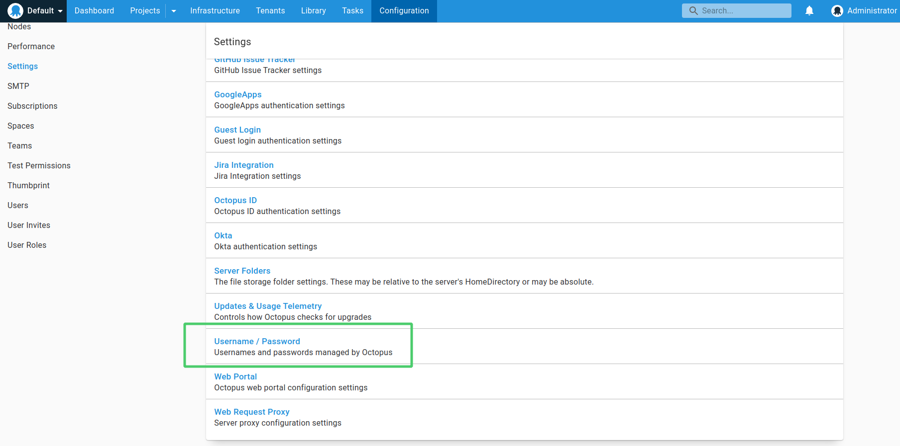
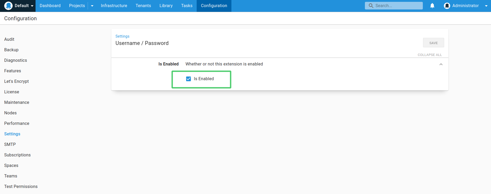
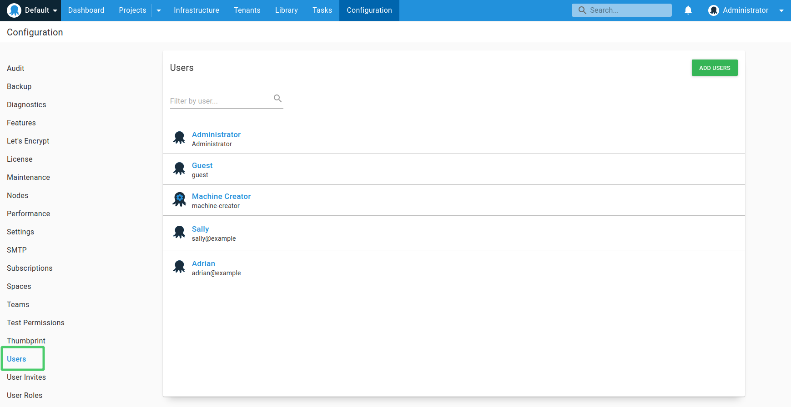
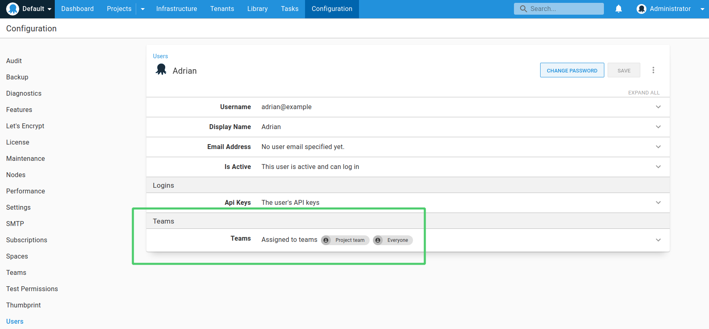

:::hint
Username and Password authentication can only be configured for Octopus Server. For [Octopus Cloud](/docs/octopus-cloud/), authentication using this provider is supported through [Octopus ID](octopusid-authentication.md). See our [authentication provider compatibility](/docs/security/authentication/auth-provider-compatibility/) section for further information. 
:::

Octopus provides a Username and Password authentication provider allowing you to create user accounts in Octopus manually without requirement for an external authentication provider.

The Username and Password provider is available out-of-the-box as one of [a number of custom Server extensions](/docs/administration/server-extensibility/customizing-an-octopus-deploy-server-extension/) provided as part of the Octopus Deploy installation. It is an open-source project and the source code is available on [GitHub](https://github.com/OctopusDeploy/UsernamePasswordAuthenticationProvider).

When Username and Password authentication is enabled, the sign in page for the Octopus Web Portal will present users with the option to sign in with an Octopus account:


## Enable username and password authentication via UI {#usernamepassword-enable-in-ui}

You can enable Username and Password authentication from the Octopus Web Portal by navigating to **{{Configuration,Settings,Username / Password}}**. From there you can click the **Is Enabled** checkbox to enable or disable the Username and Password provider.




The Username and Password provider will now be activated and available for Octopus users.

## Configuring username and password login {#usernamepassword-configure}

Octopus Server can be configured to enable or disable username and password authentication via the command line, as follows:

```powershell
Octopus.Server.exe configure --instance=[your_instance_name] --usernamePasswordIsEnabled=true
```

## Managing user permissions {#usernamepassword-userpermissions}

When a new Octopus user is created, they are automatically added to the **Everyone** team. To manage Octopus users, this can be done by navigating to **{{Configuration,Users}}**. 



With any Octopus user, you can [assign user accounts to different teams](/docs/security/users-and-teams/) to give them permissions to view projects or environments, or any additional permissions they may need:


