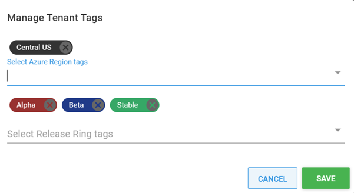

Each store in the Car Rental chain is named after the city or location they are in.  To ensure that the application is deployed to the correct location with the correct features, we must associate each tenant with the correct tags.

## Managing Tenant Tag Sets for Tenants
To manage the Tag Sets associated with a Tenant, navigate to Tenants, then select the Tenant to manage.  Click on **MANAGE TAGS** to edit which tags are associated to a Tenant

The De Moines location for Car Rental company deploys to the `Central US` Azure region and participates in all Release Rings.  This tenant will be assigned the `Central US` Azure Region tag as well as `Alpha`, `Beta`, and `Stable` Release Rings tags.

Norfolk will be assigned the Azure Region of `East US` with `Beta` and `Stable` Release Rings.  LAX will be assigned the `West US` Azure Region tag with only the `Stable` Release Ring.

<a class="btn btn-secondary" href="/docs/tenants/guides/multi-tenant-region/creating-tenant-tags">Previous</a>&nbsp;&nbsp;&nbsp;&nbsp;&nbsp;<a class="btn btn-success" href="/docs/tenants/guides/multi-tenant-region/assigning-tenants-to-infrastructure">Next</a>