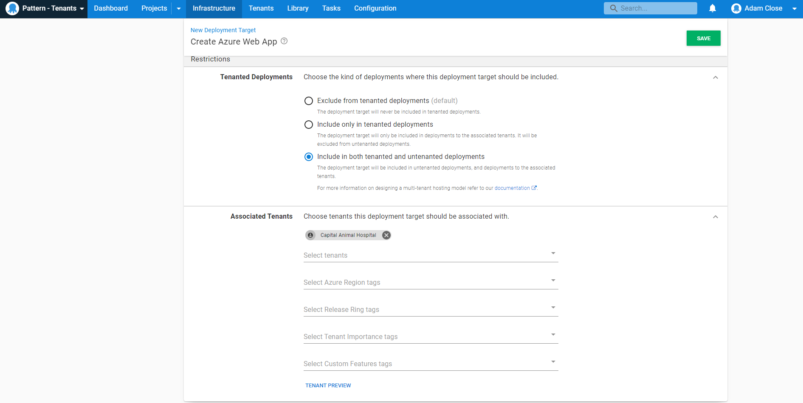

In this section, we need to add our infrastructure and associate it with our tenants. All external customers have a production environment, with some having the optional staging environment.   We only need to add a deployment target for each environment our tenant (customer) deploys to. Since our application is hosted on Azure Web Apps, we need to add an [Azure Web App deployment target](/docs/infrastructure/deployment-targets/azure/web-app-targets/index.md).

To add a new Azure Web Target, go to **{{Infrastructure, Deployment Targets}}** and click **ADD DEPLOYMENT TARGET**.

Next, go to **{{Azure, Azure Web App}}** and click **ADD**. Then, add a **Display Name**, **Environment** and **Target Role**.

Choose the Azure **Account**, **Azure Web App** and *optionally* **Azure Web App Slot** and **Worker Pool**.

Lastly associate the deployment target with a tenant.

Repeat these steps for the rest of your deployment targets and tenants.

In the next step, we'll create the [deployment process](/docs/tenants/guides/multi-tenant-saas-application/creating-project-deployment-process.md) needed for this scenario.

<a class="btn btn-secondary" href="/docs/tenants/guides/multi-tenant-saas-application/creating-project-template-variables">Previous</a>&nbsp;&nbsp;&nbsp;&nbsp;&nbsp;<a class="btn btn-success" href="/docs/tenants/guides/multi-tenant-saas-application/creating-project-deployment-process">Next</a>