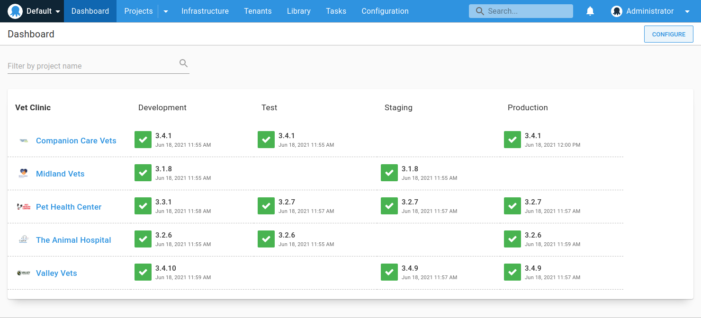

Most people who use Octopus use it to deploy projects to one or more environment.

What happens when you are providing Software as a Service (SaaS) applications and you need to deploy multiple instances of the application for each of your customers? 

You could model it with multiple projects:

Alternatively, you could model it with a single project deployed to multiple environments:

In either case, this can quickly become overwhelming. It doesn't scale well as there is a lot of duplication.

To solve this, Octopus provides first-class support for modeling tenants.

Tenants in Octopus allow you to easily create customer specific deployment pipelines without duplicating project configuration. You can
manage separate instances of your application in multiple environments in a single Octopus project.

Tenants enable:

1. Deploying multiple instances of your project to the same [Environment](/docs/infrastructure/environments/).
2. Managing configuration settings unique to each tenant.
3. Promoting releases using safe tenant-aware lifecycles.
4. Tailoring the deployment process using tenant tags.
5. Deploying to shared or dedicated infrastructure per tenant.
6. Limiting access to tenants by scoping team roles to tenants.
7. Creating release rings so that you can easily deploy to alpha and beta tenants.
8. Managing large groups of tenants using tenant tags.
9. Building simple multi-tenant deployment processes that can scale as you add more tenants.

## Types of tenants {#types-of-tenants}

Tenants usually represent the customers of your application, especially when it comes to SaaS products. 

However, we designed tenants to be generic so that they can satisfy multiple use cases.

Tenants can also represent:

- Geographical regions or datacenters
- Developers, testers, or Teams
- Feature branches

Learn more about [tenant types](/docs/tenants/tenant-types.md).

## When to use tenants {#when-to-use-tenants}

:::success
You don't need tenants to implement a multi-tenant SaaS application. You can architect your application so that one instance can serve multiple customers. We built multi-tenancy for situations where you want to deploy your application more than once in an environment.
:::

Here are some signs that you should consider using tenants:

- You need to deploy different versions of your application to the same environment.
- You are creating multiple environments of the same type. This could be multiple Test environments for different testers or multiple Production environments for different customers.

Check out our [multi-tenancy guides](/docs/tenants/guides/) that go into more detail on how to use multi-tenancy in Octopus for some common scenarios.

## Create your first tenant {#create-your-first-tenant}

With just a few simple steps, you can configure a new or existing Octopus project to use the multi-tenancy feature:

1. [Create a tenant](/docs/tenants/tenant-creation/)
1. [Enable tenanted deployments](/docs/tenants/tenant-creation/tenanted-deployments.md)
1. [Connect a tenant to a project](/docs/tenants/tenant-creation/connecting-projects.md)

## Tenant variables {#tenant-variables}

You often want to define variable values that are different for each tenant, like database connection settings or a tenant-specific URL. If you were using an untenanted project, you would have previously defined these values in the project itself. But with a tenanted project, you can set these values directly on the tenant for any connected projects.

:::hint
**Tenant-provided variables are not snapshotted**
When you [create a release](/docs/octopus-rest-api/octopus-cli/create-release.md) in Octopus Deploy we take a snapshot of the deployment process and the current state of the [project-variables](/docs/projects/variables/), however, we do not take a snapshot of tenant-variables. This enables you to add new tenants at any time and deploy to them without creating a new release. This means any changes you make to tenant-variables will take immediate effect.
:::

Learn more about [tenant variables](/docs/tenants/tenant-variables.md) in our reference documentation.

## Tenant tags {#tenant-tags}

Tenant tags help you to classify your tenants using custom tags that meet your needs, and tailor tenanted deployments for your projects and environments. Learn more about [tenant tags](/docs/tenants/tenant-tags.md) in our reference documentation.

## Troubleshooting multi-tenant deployments

If you're running into any issues with tenants, then this section has some useful answers to some of the questions we are often asked relating to multi-tenant deployments in Octopus Deploy:

- [Multi-tenant deployments FAQ](/docs/tenants/tenant-deployment-faq.md)
- [Troubleshooting multi-tenant deployments](/docs/tenants/troubleshooting-multi-tenant-deployments.md)

If you still need assistance, don't worry - [we are always here to help!](https://octopus.com/support)